

# Лабораторная работа №1
## Василий О. Худицкий 
## РУДН, 10 сентября 2022, Москва, Россия

---

# Цель лабораторной работы

- Приобретение практических навыков установки операционной системы на виртуальную машину.

- Настройка минимально необходимых для дальнейшей работы сервисов.

---

# Задание лабораторной работы

- Установить операционную систему Linux (дистрибутив Rocky) на виртуальную машину VirtualBox и настроить минимально необходимые для дальнейшей работы сервисы.

- Проанализировать последовательность загрузки системы, выполнив команду dmesg

- Ответить на контрольные вопросы

---

# Выполнение лабораторной работы

---

### Создание виртуальной машины в VirtualBox 

#### 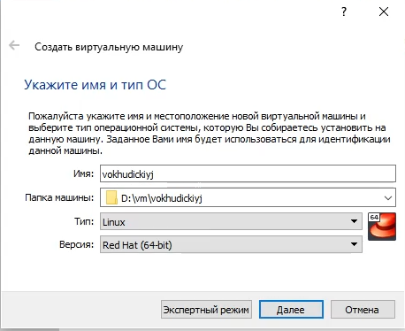
##### Рис.1 Создание виртуальной машины

---

### Выбор объема оперативной памяти

#### 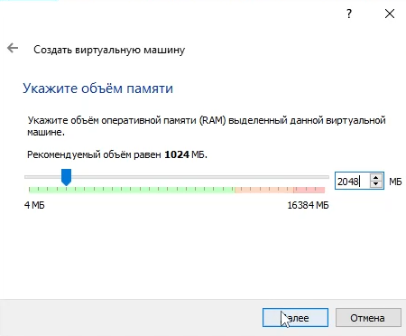
##### Рис.2 Объем оперативной памяти

---

### Создание виртуального жесткого диска

#### 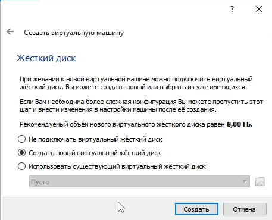
##### Рис.3 Создание виртуального жесткого диска

---

### Выбор образа операционной системы 

#### 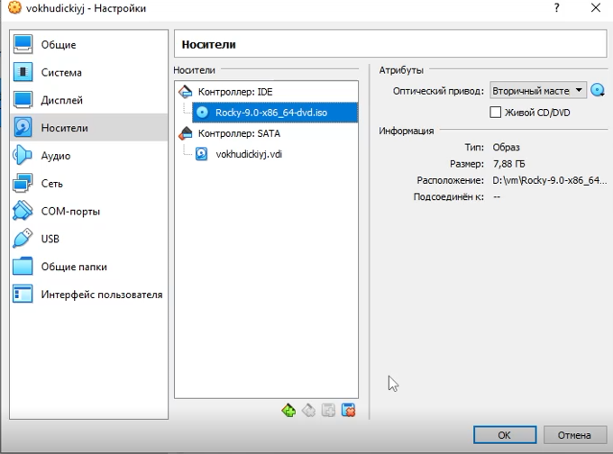
##### Рис.4 Выбор образа операционной системы

---

### Выбор языка 

#### 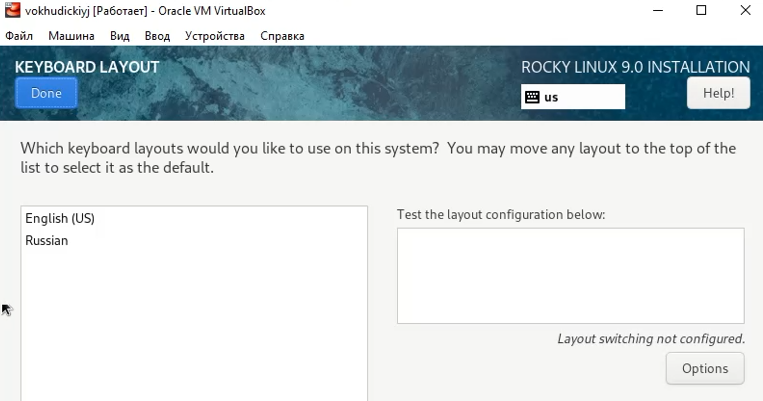
##### Рис.5 Выбор языка

---

### Выбор пакета программ 

#### 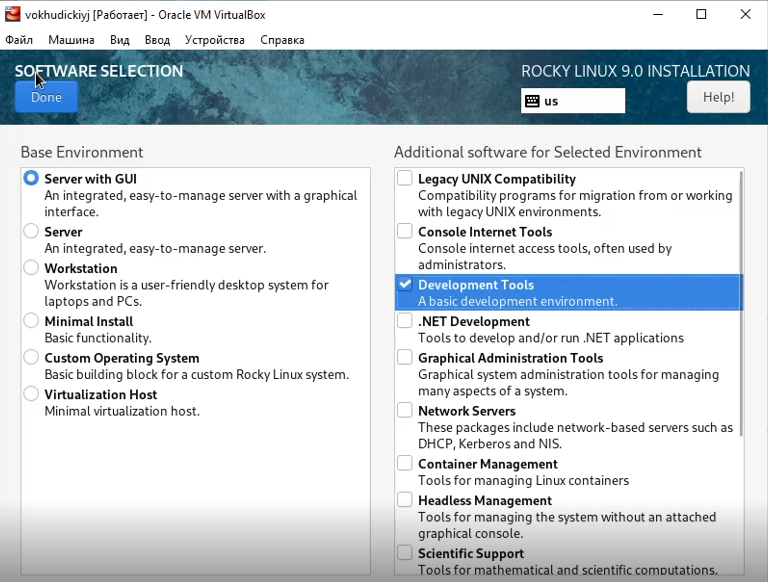
##### Рис.6 Выбор пакета программ

---

### Отключение KDUMP 

#### 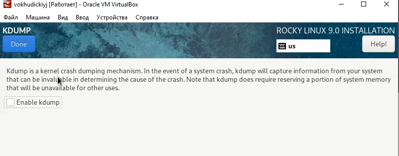
##### Рис.7 Отключение KDUMP

---

### Включение сетевого соединения 

#### 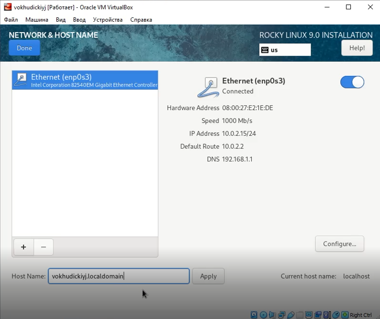
##### Рис.8 Включение сетевого соединения

---

### Установка пароля для root и создание пользователя с правами администратора 

#### 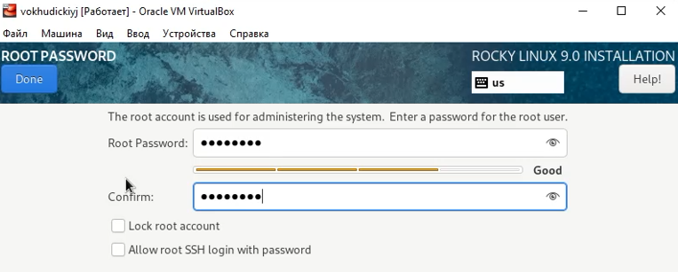
##### Рис.9 Установка пароля для root

---

# Подключение диска дополнительной гостевой ОС 

#### 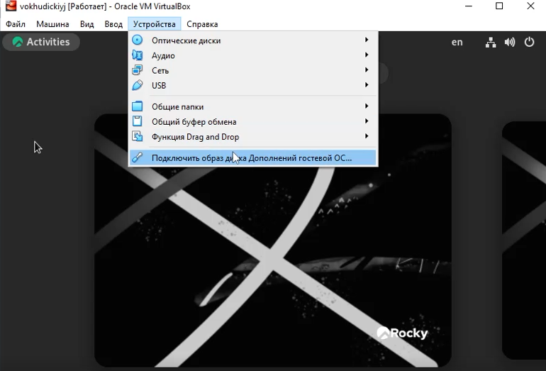
##### Рис.10 Подключение диска дополнительной гостевой ОС

---

# Домашнее задание

---

#### 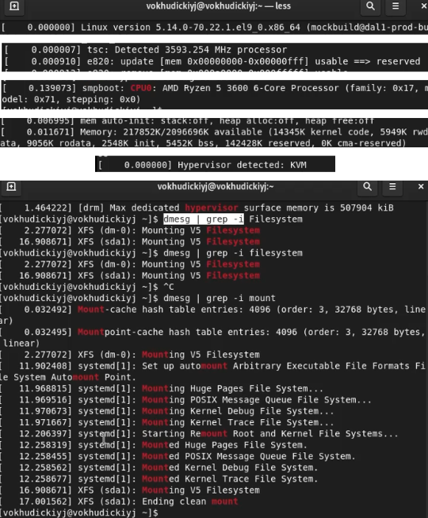
##### Рис.12 Домашнее задание

---

# Выводы
В ходе выполнения лабораторной работы я 
- приобрел практические навыки установки операционной системы на виртуальную машину 
- настроил минимально необходимые для дальнейшей работы сервисы.
