---
# Front matter
lang: ru-RU
title: "Лабораторная работа №1"
subtitle: "Информационная безопасность"
author: "Худицкий Василий Олегович"

# Formatting
toc-title: "Содержание"
toc: true # Table of contents
toc_depth: 2
lof: true # List of figures
fontsize: 12pt
linestretch: 1.5
papersize: a4paper
documentclass: scrreprt
polyglossia-lang: russian
polyglossia-otherlangs: english
mainfont: PT Serif
romanfont: PT Serif
sansfont: PT Sans
monofont: PT Mono
mainfontoptions: Ligatures=TeX
romanfontoptions: Ligatures=TeX
sansfontoptions: Ligatures=TeX,Scale=MatchLowercase
monofontoptions: Scale=MatchLowercase
indent: true
pdf-engine: lualatex
header-includes:
  - \linepenalty=10 # the penalty added to the badness of each line within a paragraph (no associated penalty node) Increasing the value makes tex try to have fewer lines in the paragraph.
  - \interlinepenalty=0 # value of the penalty (node) added after each line of a paragraph.
  - \hyphenpenalty=50 # the penalty for line breaking at an automatically inserted hyphen
  - \exhyphenpenalty=50 # the penalty for line breaking at an explicit hyphen
  - \binoppenalty=700 # the penalty for breaking a line at a binary operator
  - \relpenalty=500 # the penalty for breaking a line at a relation
  - \clubpenalty=150 # extra penalty for breaking after first line of a paragraph
  - \widowpenalty=150 # extra penalty for breaking before last line of a paragraph
  - \displaywidowpenalty=50 # extra penalty for breaking before last line before a display math
  - \brokenpenalty=100 # extra penalty for page breaking after a hyphenated line
  - \predisplaypenalty=10000 # penalty for breaking before a display
  - \postdisplaypenalty=0 # penalty for breaking after a display
  - \floatingpenalty = 20000 # penalty for splitting an insertion (can only be split footnote in standard LaTeX)
  - \raggedbottom # or \flushbottom
  - \usepackage{float} # keep figures where there are in the text
  - \floatplacement{figure}{H} # keep figures where there are in the text
---

# Цель работы

1. Приобретение практических навыков установки операционной системы на виртуальную машину;
2. Настройка минимально необходимых для дальнейшей работы сервисов.

# Выполнение лабораторной работы

##Установка операционной системы и настройка сервисов

Создаем виртуальную машину в VirtualBox. 

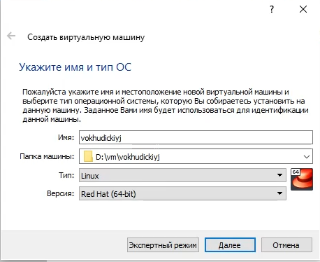{#fig:001}

Указываем объем оперативной памяти, выделенный виртуальной машине.

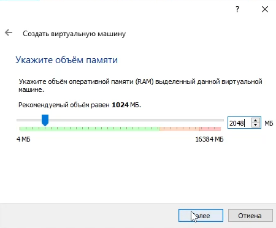{#fig:002}

Создаем новый динамический виртуальный жесткий диск типа VDI и задаем его размер.

{#fig:003}

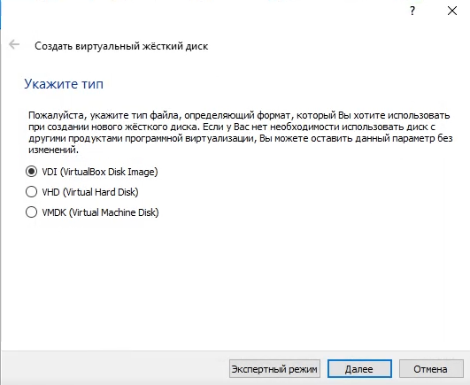{#fig:004}

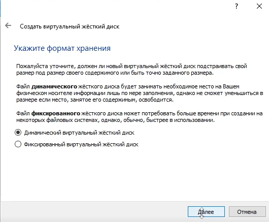{#fig:005}

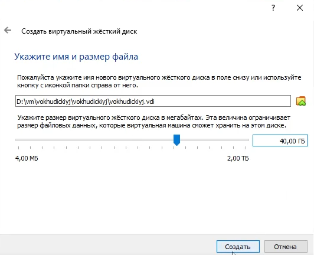{#fig:006}

В VirtualBox  добавляем новый привод оптических дисков, где выбираем заранее скачанный образ выбранной операционной системы.

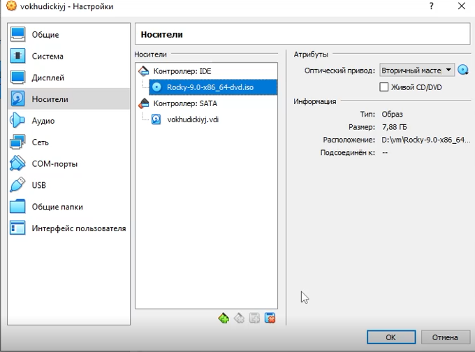{#fig:007}

После этого запускаем виртуальную машину и начинаем установку ОС.

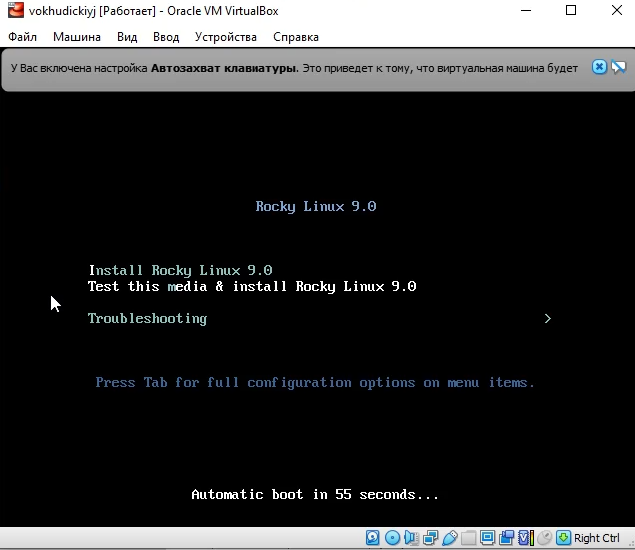{#fig:008}

По ходу начальной настройки ОС перед ее установкой нужно выполнить несколько шагов.

1. Выбрать язык

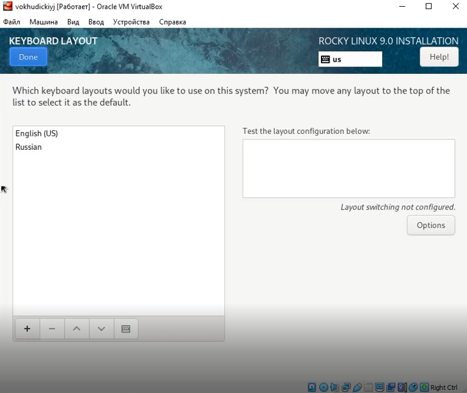{#fig:009}

2) Настроить часовой пояс если требуется.

3. Выбрать пакет предустановленных программ.

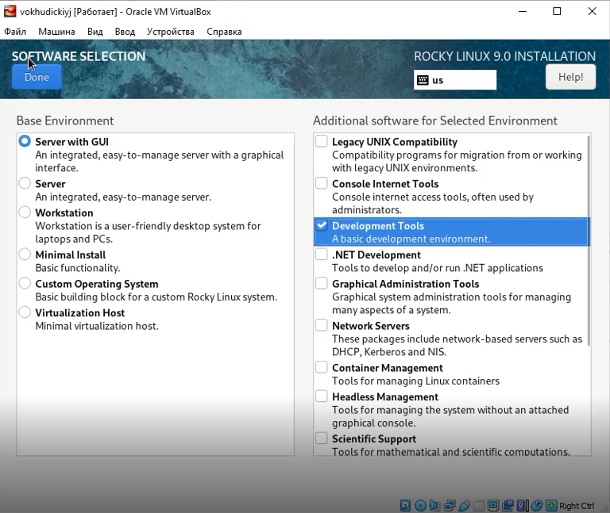{#fig:010}

4. Отключить KDUMP.

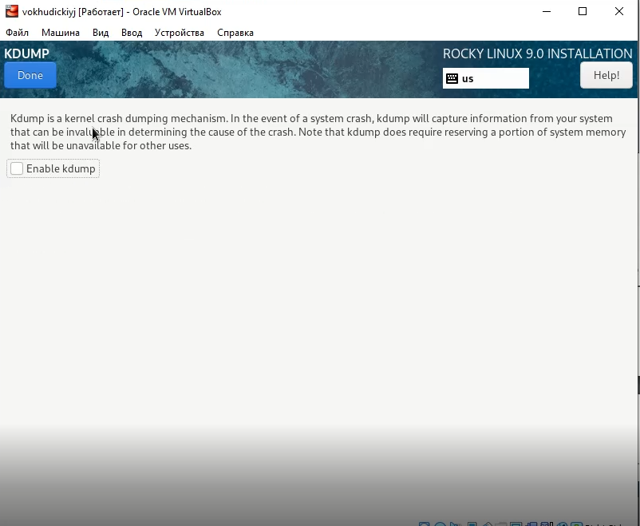{#fig:011}

5. Включить сетевое соединение.

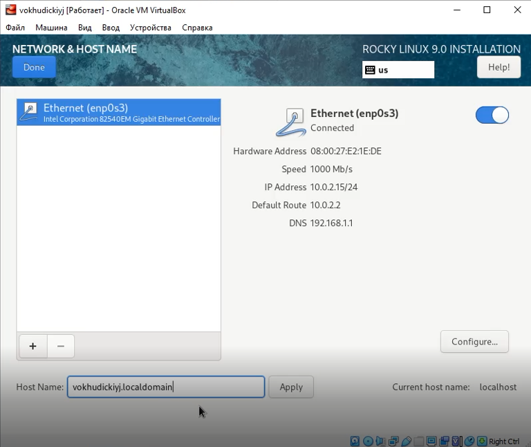{#fig:012}

6. Установить пароль для root и создать пользователя с правами администратора.

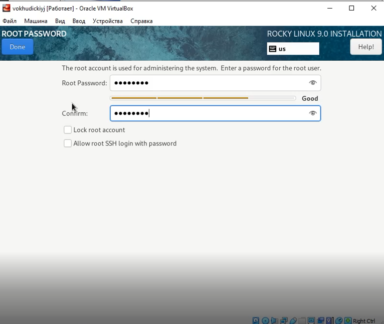{#fig:013}

7. Перезагрузить систему и принять лицензию.

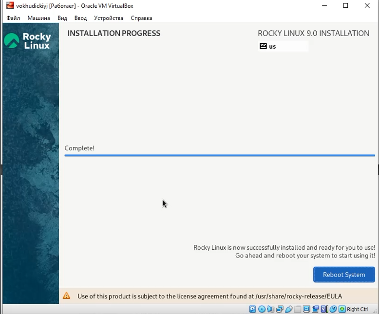{#fig:014}

После перезагрузки подключаем образ диска дополнительной гостевой ОС.

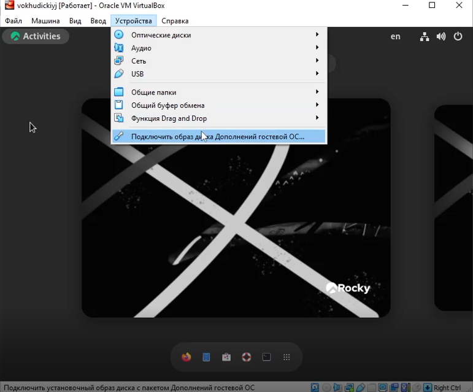{#fig:015}

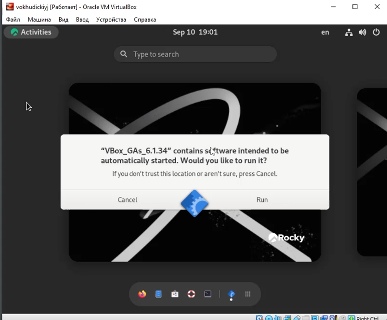{#fig:016}

##Домашнее задания

Проанализировать последовательность загрузки системы, выполнив команду dmesg. 

С помощью команды dmesg была получена следующая информация:

1. Версия ядра Linux: 5.14.0-70.22.1.el9_0.x86_64
2. Частота процессора: 3593.254 MHz
3. Модель процессора: AMD Ryzen 5 3600 6-Core Processor
4. Объем доступной памяти: 217852k/2096696k
5. Тип обнаруженного гипервизора: KVM
6. Тип файловой системы корневого раздела: XFS

{#fig:017}

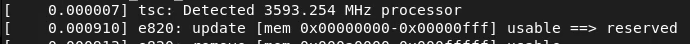{#fig:022}

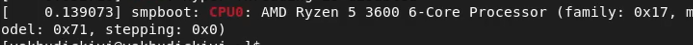{#fig:018}

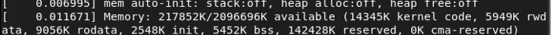{#fig:019}

{#fig:020}

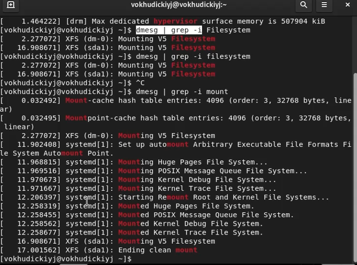{#fig:021}

# Выводы

В ходе выполнения лабораторной работы я приобрел практические навыки установки операционной системы на виртуальную машину и настроил минимально необходимые для дальнейшей работы сервисы.

# Список литературы

- <code>[Кулябов Д. С., Королькова А. В., Геворкян М. Н Лабораторная работа № 1. Установка и конфигурация операционной системы на виртуальную машину](https://esystem.rudn.ru/pluginfile.php/1651744/mod_folder/content/0/001-lab_virtualbox.pdf?forcedownload=1)</code>