

# Лабораторная работа №2
## Василий О. Худицкий 
## РУДН, 17 сентября 2022, Москва, Россия

---

# Цель лабораторной работы

- Получение практических навыков работы в консоли с атрибутами файлов. 
- Закрепление теоретических основ дискреционного разграничения доступа в современных системах с открытым кодом на базе ОС Linux.

---

# Задание лабораторной работы

- Выполнить задания лабораторной работы.

- Проанализировать полученные результаты.

---

# Выполнение лабораторной работы

---

# Создание пользователя guest 

#### 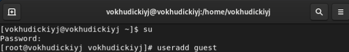
##### Рис.1 Создание пользователя guest

---

# Установка пароля

#### 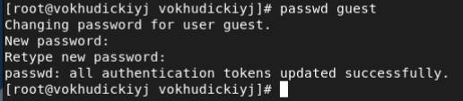
##### Рис.2 Установка пароля

---

# Определение текущей директории

#### 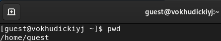
##### Рис.3 Определение текущей директории

---

# Определение имени пользователя

#### 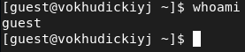
##### Рис.4 Имя пользователя

---

# Уточнение имени пользователя, его группы, а также групп, в которые он входит 

#### 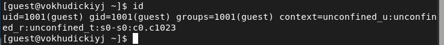
##### Рис.5 Команда id

---

# Просмотр файла /etc/passwd

#### 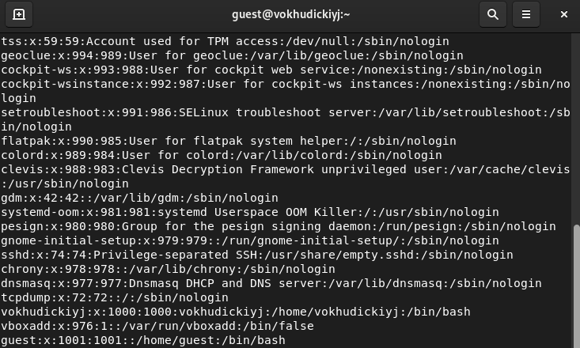
##### Рис.6 Файл /etc/passwd

---

# Существующие в системе директории

#### 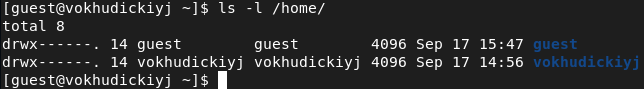
##### Рис.7 Существующие в системе директории

---

# Расширенные атрибуты

#### 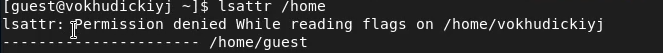
##### Рис.8 Расширенные атрибуты

---

# Новая директория и информация о ней

#### 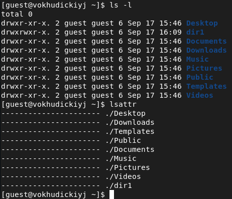
##### Рис.9 Директория dir1 и информация о ней

---

# Установленные права и разрешённые действия

#### 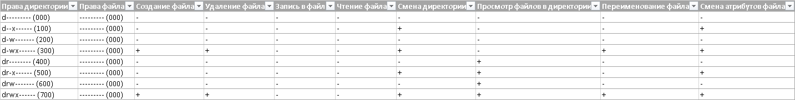
##### Рис.10 Фрагмент таблицы «Установленные права и разрешённые действия»

---

# Минимально необходимые права для выполнения операций внутри директории

---

#### 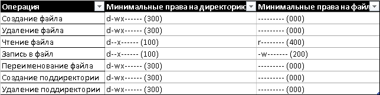
##### Рис.11 Таблица «Минимально необходимые права для выполнения операций внутри директории»

---

# Выводы
В ходе выполнения лабораторной работы я 
- получил практические навыки работы в консоли с атрибутами файлов 
- закрепил теоретические основы дискреционного разграничения доступа в современных системах с открытым кодом на базе ОС Linux.
