---
# Front matter
lang: ru-RU
title: "Лабораторная работа №2"
subtitle: "Информационная безопасность"
author: "Худицкий Василий Олегович"

# Formatting
toc-title: "Содержание"
toc: true # Table of contents
toc_depth: 2
lof: true # List of figures
fontsize: 12pt
linestretch: 1.5
papersize: a4paper
documentclass: scrreprt
polyglossia-lang: russian
polyglossia-otherlangs: english
mainfont: PT Serif
romanfont: PT Serif
sansfont: PT Sans
monofont: PT Mono
mainfontoptions: Ligatures=TeX
romanfontoptions: Ligatures=TeX
sansfontoptions: Ligatures=TeX,Scale=MatchLowercase
monofontoptions: Scale=MatchLowercase
indent: true
pdf-engine: lualatex
header-includes:
  - \linepenalty=10 # the penalty added to the badness of each line within a paragraph (no associated penalty node) Increasing the value makes tex try to have fewer lines in the paragraph.
  - \interlinepenalty=0 # value of the penalty (node) added after each line of a paragraph.
  - \hyphenpenalty=50 # the penalty for line breaking at an automatically inserted hyphen
  - \exhyphenpenalty=50 # the penalty for line breaking at an explicit hyphen
  - \binoppenalty=700 # the penalty for breaking a line at a binary operator
  - \relpenalty=500 # the penalty for breaking a line at a relation
  - \clubpenalty=150 # extra penalty for breaking after first line of a paragraph
  - \widowpenalty=150 # extra penalty for breaking before last line of a paragraph
  - \displaywidowpenalty=50 # extra penalty for breaking before last line before a display math
  - \brokenpenalty=100 # extra penalty for page breaking after a hyphenated line
  - \predisplaypenalty=10000 # penalty for breaking before a display
  - \postdisplaypenalty=0 # penalty for breaking after a display
  - \floatingpenalty = 20000 # penalty for splitting an insertion (can only be split footnote in standard LaTeX)
  - \raggedbottom # or \flushbottom
  - \usepackage{float} # keep figures where there are in the text
  - \floatplacement{figure}{H} # keep figures where there are in the text
---

# Цель работы

Получение практических навыков работы в консоли с атрибутами файлов, закрепление теоретических основ дискреционного разграничения доступа в современных системах с открытым кодом на базе ОС Linux.

# Задание

Выполнить задания лабораторной работы и проанализировать полученные результаты.

# Теоретическое введение

Дискреционное управление доступом (англ. discretionary access control, DAC) — управление доступом субъектов к объектам на основе списков управления доступом или матрицы доступа. Также используются названия избирательное управление доступом, контролируемое управление доступом и разграничительное управление доступом.

Для каждой пары (субъект — объект) должно быть задано явное и недвусмысленное перечисление допустимых типов доступа, то есть тех типов доступа, которые являются санкционированными для данного субъекта (индивида или группы индивидов) к данному ресурсу (объекту).

Возможны несколько подходов к построению дискреционного управления доступом:

* Каждый объект системы имеет привязанного к нему субъекта, называемого владельцем. Именно владелец устанавливает права доступа к объекту.
* Система имеет одного выделенного субъекта — суперпользователя, который имеет право устанавливать права владения для всех остальных субъектов системы.
* Субъект с определённым правом доступа может передать это право любому другому субъекту.

Возможны и смешанные варианты построения, когда одновременно в системе присутствуют как владельцы, устанавливающие права доступа к своим объектам, так и суперпользователь, имеющий возможность изменения прав для любого объекта и/или изменения его владельца. Именно такой смешанный вариант реализован в большинстве операционных систем, например Unix.

Избирательное управление доступом является основной реализацией разграничительной политики доступа к ресурсам при обработке конфиденциальных сведений, согласно требованиям к системе защиты информации.

# Выполнение лабораторной работы

1.  В установленной при выполнении предыдущей лабораторной работы операционной системе с помощью команды *useradd guest* создал учётную запись пользователя guest:

  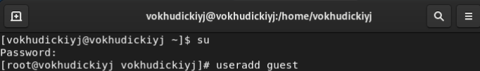{#fig:001}

2.  Задал с помощью команды *passwd guest* пароль для пользователя guest:

  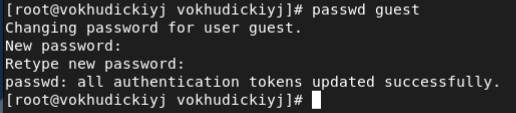{#fig:002}

3.  Вошёл в систему от имени пользователя guest:

  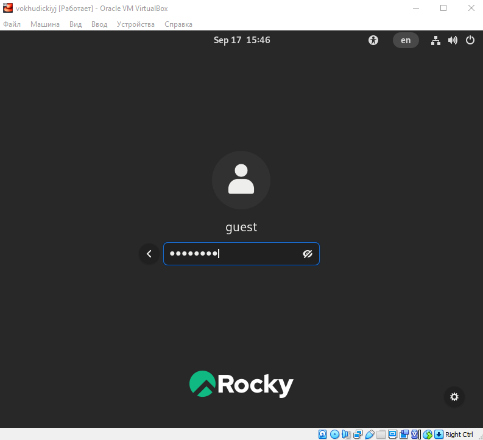{#fig:003}

4.  Определил директорию, в которой я нахожусь, с помощью команды *pwd*. Она совпадает с приглашением командной строки и является домашней для guest:

  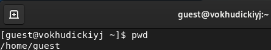{#fig:004}

5.  Уточнил имя пользователя командой *whoami*:

  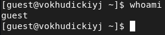{#fig:005}

6.  Уточнил имя пользователя, его группу, а также группы, куда входит пользователь, командой *id*. Сравнил вывод *id* с выводом команды *groups*, названия групп совпали совпали.

  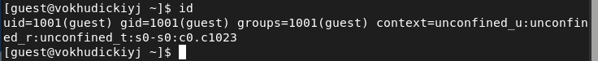{#fig:006}

  {#fig:007}

7.  Сравнил полученную информацию об имени пользователя с данными, выводимыми в приглашении командной строки. Имя пользователя совпало с приглашением командной строки.

8. Просмотрел файл /etc/passwd командой *cat /etc/passwd*. Нашёл в нём свою учётную запись. Определил uid и gid пользователя. Найденные значения совпали с полученными в предыдущих пунктах.

  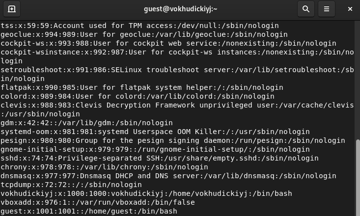{#fig:008}

9.  Определил существующие в системе директории командой *ls -l /home/*. Только владельцы папок имеют все права на директориях.

  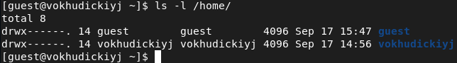{#fig:009}

10.  Проверил, какие расширенные атрибуты установлены на поддиректориях, находящихся в директории /home, командой *lsattr /home*. Удалось увидеть только атрибуты директории пользователя guest:

  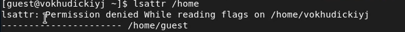{#fig:010}

11.  Создал в домашней директории поддиректорию dir1 командой *mkdir dir1*. Определил командами *ls -l* и *lsattr*, какие права доступа и расширенные атрибуты были выставлены на директорию dir1:

   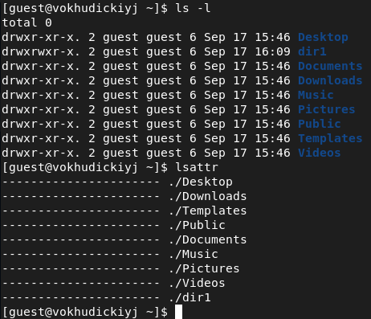{#fig:011}

12.  Снял с директории dir1 все атрибуты командой *chmod 000 dir1* и проверил с её помощью правильность выполнения команды *ls -l*.

   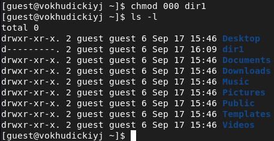{#fig:012}

13.  Попытался создать в директории dir1 файл file1 командой *echo "test" > /home/guest/dir1/file1*. Получил отказ, так как теперь у меня нет прав на директорию dir1. Попытался проверить создание файла командой *ls -l /home/guest/dir1*, но получил отказ из-за отсутствия прав:

   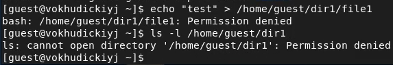{#fig:013}

14.  Заполнил [таблицу «Установленные права и разрешённые действия»](#fig:014). Выполняя действия от имени владельца директории (файлов), определил опытным путём, какие операции разрешены, а какие нет.

   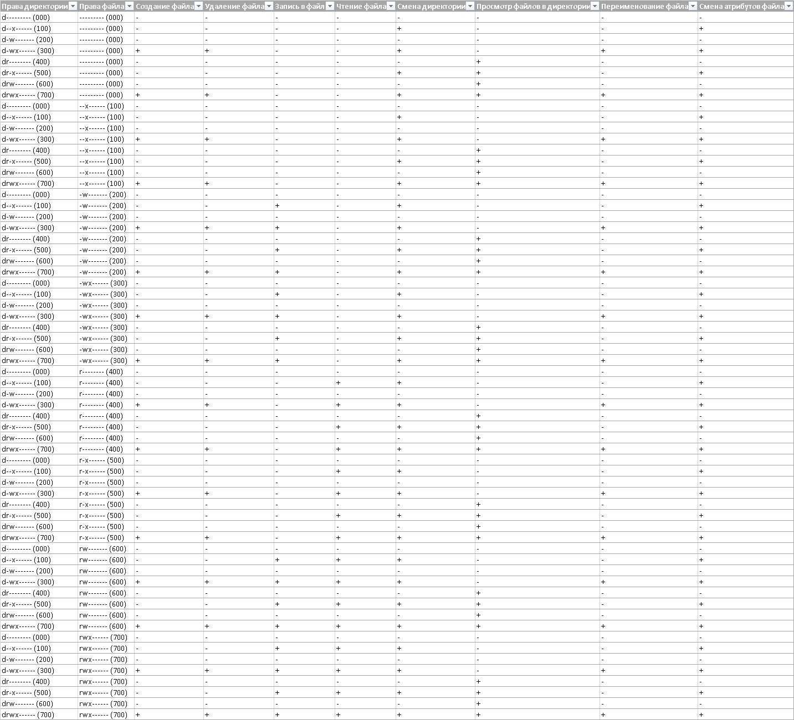{#fig:014}

15.  На основании заполненной таблицы определил те или иные минимально необходимые права для выполнения операций внутри директории dir1, заполнил [таблицу](#fig:015).

   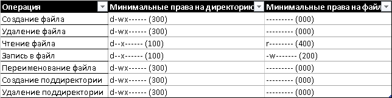{#fig:015}

   

# Выводы

Я получил практические навыки работы в консоли с атрибутами файлов и закрепил теоретические основы дискреционного разграничения доступа в современных системах с открытым кодом на базе ОС Linux.

# Список литературы

- <code>[Кулябов Д. С., Королькова А. В., Геворкян М. Н Лабораторная работа №2. Дискреционное разграничение прав в Linux. Основные атрибуты](https://esystem.rudn.ru/mod/resource/view.php?id=892016)</code>