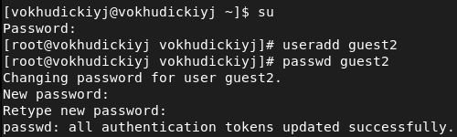
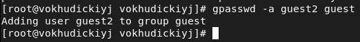
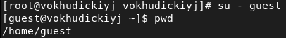
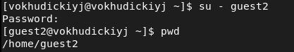
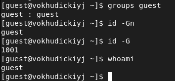
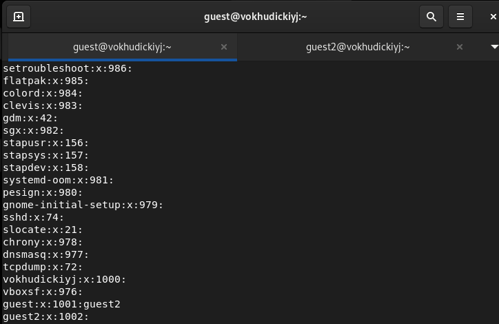
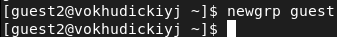
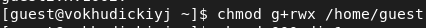
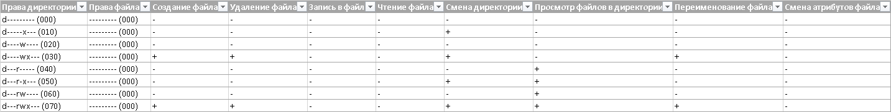
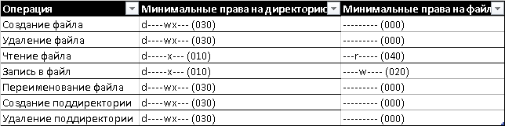

# Лабораторная работа №3
## Василий О. Худицкий 
## РУДН, 24 сентября 2022, Москва, Россия

---

# Цель лабораторной работы

- Получение практических навыков работы в консоли с атрибутами файлов для групп пользователей.

---

# Задание лабораторной работы

- Выполнить задания лабораторной работы.

- Проанализировать полученные результаты.

---

# Выполнение лабораторной работы

---

# Создание пользователя guest2 

#### 
##### Рис.1 Создание пользователя guest2

---

# Добавление в группу

#### 
##### Рис.2 Добавление guest2 в группу guest

---

# Определение текущей директории

#### 
##### Рис.3 Определение текущей директории
#### 
##### Рис.4 Определение текущей директории
---

# Уточнение имени пользователя, его группы, а также групп, в которые он входит 

#### 
##### Рис.5 Команды для guest

---

# Просмотр файла /etc/group

#### 
##### Рис.6 Файл /etc/group

---

#  Регистрация пользователя guest2 в группе guest

#### 
##### Рис.7 Регистрация пользователя guest2 в группе guest

---

# Предоставление всех прав группе

#### 
##### Рис.8 Изменение разрешений для директории /home/guest

---

# Установленные права и разрешённые действия

#### 
##### Рис.9 Фрагмент таблицы «Установленные права и разрешённые действия»

---

# Минимально необходимые права для выполнения операций внутри директории

---

#### 
##### Рис.10 Таблица «Минимально необходимые права для выполнения операций внутри директории»

---

# Выводы
В ходе выполнения лабораторной работы я 
- получил практические навыки работы в консоли с атрибутами файлов для групп пользователей.