---
# Front matter
lang: ru-RU
title: "Лабораторная работа №3"
subtitle: "Информационная безопасность"
author: "Худицкий Василий Олегович"

# Formatting
toc-title: "Содержание"
toc: true # Table of contents
toc_depth: 2
lof: true # List of figures
fontsize: 12pt
linestretch: 1.5
papersize: a4paper
documentclass: scrreprt
polyglossia-lang: russian
polyglossia-otherlangs: english
mainfont: PT Serif
romanfont: PT Serif
sansfont: PT Sans
monofont: PT Mono
mainfontoptions: Ligatures=TeX
romanfontoptions: Ligatures=TeX
sansfontoptions: Ligatures=TeX,Scale=MatchLowercase
monofontoptions: Scale=MatchLowercase
indent: true
pdf-engine: lualatex
header-includes:
  - \linepenalty=10 # the penalty added to the badness of each line within a paragraph (no associated penalty node) Increasing the value makes tex try to have fewer lines in the paragraph.
  - \interlinepenalty=0 # value of the penalty (node) added after each line of a paragraph.
  - \hyphenpenalty=50 # the penalty for line breaking at an automatically inserted hyphen
  - \exhyphenpenalty=50 # the penalty for line breaking at an explicit hyphen
  - \binoppenalty=700 # the penalty for breaking a line at a binary operator
  - \relpenalty=500 # the penalty for breaking a line at a relation
  - \clubpenalty=150 # extra penalty for breaking after first line of a paragraph
  - \widowpenalty=150 # extra penalty for breaking before last line of a paragraph
  - \displaywidowpenalty=50 # extra penalty for breaking before last line before a display math
  - \brokenpenalty=100 # extra penalty for page breaking after a hyphenated line
  - \predisplaypenalty=10000 # penalty for breaking before a display
  - \postdisplaypenalty=0 # penalty for breaking after a display
  - \floatingpenalty = 20000 # penalty for splitting an insertion (can only be split footnote in standard LaTeX)
  - \raggedbottom # or \flushbottom
  - \usepackage{float} # keep figures where there are in the text
  - \floatplacement{figure}{H} # keep figures where there are in the text
---

# Цель работы

Получение практических навыков работы в консоли с атрибутами файлов для групп пользователей.

# Задание

Выполнить задания лабораторной работы и проанализировать полученные результаты.

# Теоретическое введение

Дискреционное управление доступом (англ. discretionary access control, DAC) — управление доступом субъектов к объектам на основе списков управления доступом или матрицы доступа. Также используются названия избирательное управление доступом, контролируемое управление доступом и разграничительное управление доступом.

Для каждой пары (субъект — объект) должно быть задано явное и недвусмысленное перечисление допустимых типов доступа, то есть тех типов доступа, которые являются санкционированными для данного субъекта (индивида или группы индивидов) к данному ресурсу (объекту).

Возможны несколько подходов к построению дискреционного управления доступом:

* Каждый объект системы имеет привязанного к нему субъекта, называемого владельцем. Именно владелец устанавливает права доступа к объекту.
* Система имеет одного выделенного субъекта — суперпользователя, который имеет право устанавливать права владения для всех остальных субъектов системы.
* Субъект с определённым правом доступа может передать это право любому другому субъекту.

Возможны и смешанные варианты построения, когда одновременно в системе присутствуют как владельцы, устанавливающие права доступа к своим объектам, так и суперпользователь, имеющий возможность изменения прав для любого объекта и/или изменения его владельца. Именно такой смешанный вариант реализован в большинстве операционных систем, например Unix.

Избирательное управление доступом является основной реализацией разграничительной политики доступа к ресурсам при обработке конфиденциальных сведений, согласно требованиям к системе защиты информации.

# Выполнение лабораторной работы

При выполнении предыдущей лабораторной работы создал учётную запись пользователя guest и задал с помощью команды *passwd guest* пароль для пользователя guest.

Аналогично создал второго пользователя guest2:

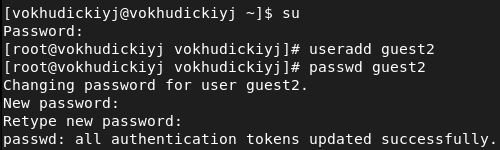{#fig:001}

Добавил пользователя guest2 в группу guest:

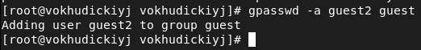{#fig:002}

Осуществил вход в систему от двух пользователей на двух разных консолях: guest на первой консоли и guest2 на второй консоли. Для обоих пользователей командой pwd определил директорию, в которой нахожусь. Это домашняя директория, она совпадает с приглашениями командной строки:

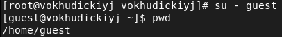{#fig:003}

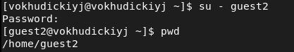{#fig:004}

Уточнил имя пользователя, его группу, кто входит в неё и к каким группам принадлежит он сам. Определил командами groups guest и groups guest2, в какие группы входят пользователи guest и guest2. Вывод команды groups совпадает с выводом команды id -Gn. id -G показывает gid групп.

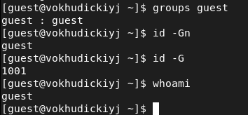{#fig:005}

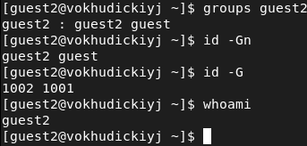{#fig:006}

Просмотрел файл /etc/group командой *cat /etc/group*. Найденные значения совпали с полученными в предыдущих пунктах.

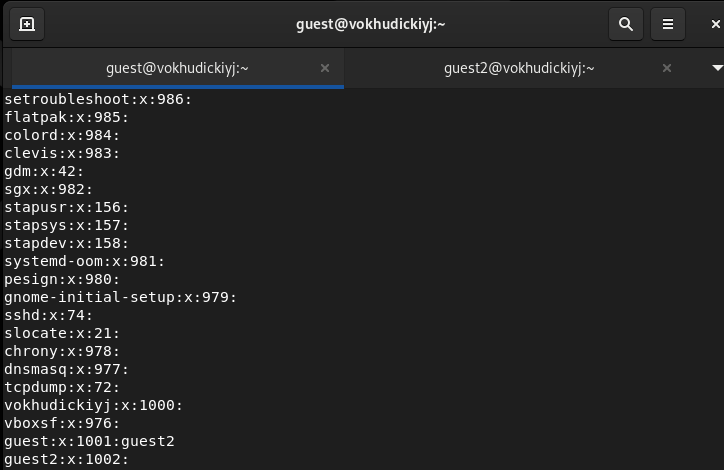{#fig:007}

От имени пользователя guest2 выполнил регистрацию пользователя guest2 в группе guest командой newgrp guest

{#fig:008}

От имени пользователя guest изменил права директории /home/guest, разрешив все действия для пользователей группы:

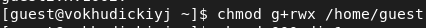{#fig:009}

От имени пользователя guest снял с директории dir1 все атрибуты командой *chmod 000 dir1* и проверил правильность снятия атрибутов командой*ls -l*б а также попытавшись создать  в директории dir1 файл file1 командой *echo "test" > /home/guest/dir1/file1*. 

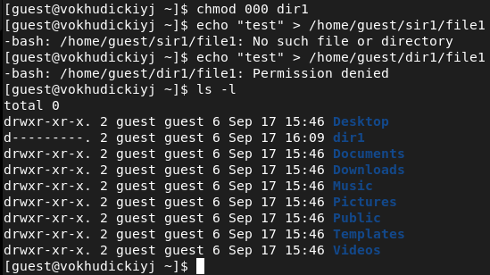{#fig:010}

Заполнил [таблицу «Установленные права и разрешённые действия»](#fig:011). Меняя атрибуты у директории dir1 и файла file1 от имени пользователя guest и делая проверку от пользователя guest2, определил опытным путём, какие операции разрешены, а какие нет.

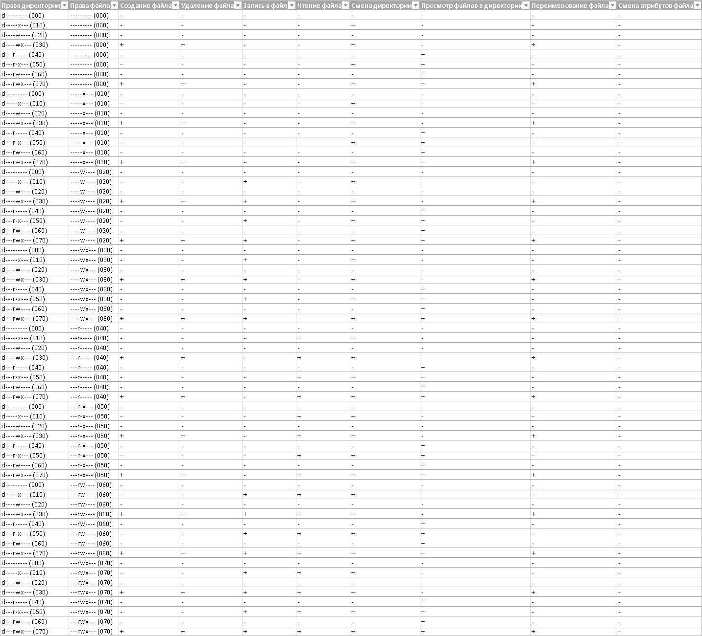{#fig:011}

На основании заполненной таблицы определил те или иные минимально необходимые права для выполнения операций внутри директории dir1, заполнил [таблицу](#fig:012).

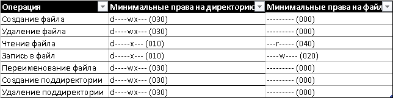{#fig:012}

# Выводы

Я получил практические навыки работы в консоли с атрибутами файлов для групп пользователей.

# Список литературы

- <code>[Кулябов Д. С., Королькова А. В., Геворкян М. Н Лабораторная работа №3. Дискреционное разграничение прав в Linux. Два пользователя](https://esystem.rudn.ru/pluginfile.php/1651749/mod_resource/content/4/003-lab_discret_2users.pdf)</code>