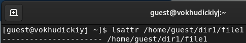
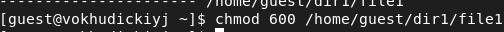
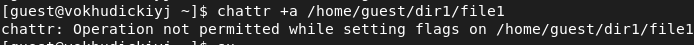
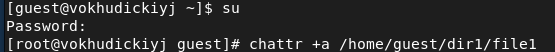
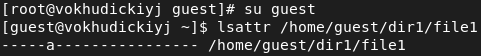
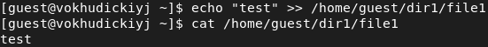
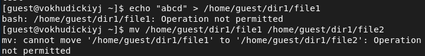
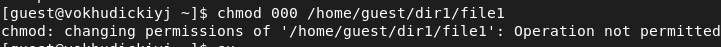
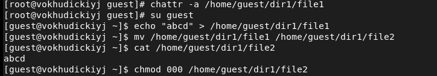
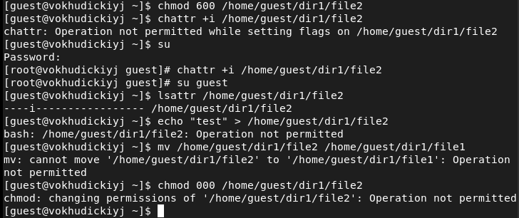

# Лабораторная работа №4
## Василий О. Худицкий 
## РУДН, 1 октября 2022, Москва, Россия

---

# Цель лабораторной работы

- Получение практических навыков работы в консоли с расширенными атрибутами файлов.

---

# Задание лабораторной работы

- Выполнить задания лабораторной работы.

- Проанализировать полученные результаты.

---

# Выполнение лабораторной работы

---

# Расширенные атрибуты

#### 
##### Рис.1 Расширенные атрибуты файла file1

---

# Установка прав

#### 
##### Рис.2 Права, разрешающие чтение и запись для владельца файла file1

---

# Установка расширенного атрибута a

#### 
##### Рис.3 Попытка установки от имени guest
#### 
##### Рис.4 Установка от имени root
---

# Проверка установления атрибута a 

#### 
##### Рис.5 Проверка установления атрибута a от имени guest

---

# Дозапись в файл

#### 
##### Рис.6 Дозапись в файл file1

---

#  Перезапись и переименование файла

#### 
##### Рис.7 Перезапись и переименование файла командами echo и mv

---

# Попытка изменения прав

#### 
##### Рис.8 Изменение разрешений для файла /home/guest/dir1/file1

---

# Снятие атрибута a

#### 
##### Рис.9 Снятие атрибута a и повторение невыполненных ранее операций

---

# Повторение действий по шагам для атрибута i

#### 
##### Рис.10 Шаги 2-8 для атрибута i

---

# Выводы
В результате выполнения лабораторных работ я 
- повысил свои навыки использования интерфейса командой строки (CLI); 
- познакомился на примерах с тем, как используются основные и расширенные атрибуты при разграничении доступа;
- имел возможность связать теорию дискреционного разделения доступа (дискреционная политика безопасности) с её реализацией на практике в ОС Linux;
- составил наглядные таблицы, поясняющие какие операции возможны при тех или иных установленных правах ;
- опробовал действие на практике расширенных атрибутов «а» и «i».