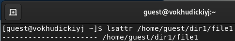
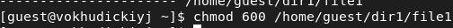
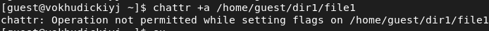
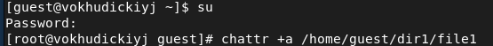
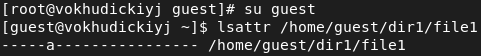
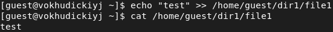
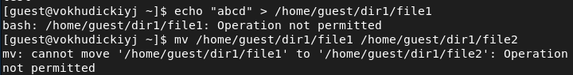
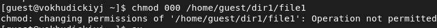
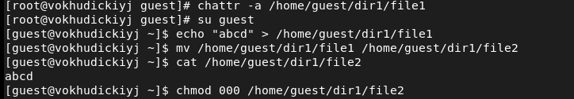
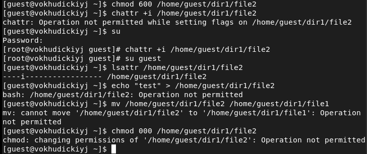

---
# Front matter
lang: ru-RU
title: "Лабораторная работа №4"
subtitle: "Информационная безопасность"
author: "Худицкий Василий Олегович"

# Formatting
toc-title: "Содержание"
toc: true # Table of contents
toc_depth: 2
lof: true # List of figures
fontsize: 12pt
linestretch: 1.5
papersize: a4paper
documentclass: scrreprt
polyglossia-lang: russian
polyglossia-otherlangs: english
mainfont: PT Serif
romanfont: PT Serif
sansfont: PT Sans
monofont: PT Mono
mainfontoptions: Ligatures=TeX
romanfontoptions: Ligatures=TeX
sansfontoptions: Ligatures=TeX,Scale=MatchLowercase
monofontoptions: Scale=MatchLowercase
indent: true
pdf-engine: lualatex
header-includes:
  - \linepenalty=10 # the penalty added to the badness of each line within a paragraph (no associated penalty node) Increasing the value makes tex try to have fewer lines in the paragraph.
  - \interlinepenalty=0 # value of the penalty (node) added after each line of a paragraph.
  - \hyphenpenalty=50 # the penalty for line breaking at an automatically inserted hyphen
  - \exhyphenpenalty=50 # the penalty for line breaking at an explicit hyphen
  - \binoppenalty=700 # the penalty for breaking a line at a binary operator
  - \relpenalty=500 # the penalty for breaking a line at a relation
  - \clubpenalty=150 # extra penalty for breaking after first line of a paragraph
  - \widowpenalty=150 # extra penalty for breaking before last line of a paragraph
  - \displaywidowpenalty=50 # extra penalty for breaking before last line before a display math
  - \brokenpenalty=100 # extra penalty for page breaking after a hyphenated line
  - \predisplaypenalty=10000 # penalty for breaking before a display
  - \postdisplaypenalty=0 # penalty for breaking after a display
  - \floatingpenalty = 20000 # penalty for splitting an insertion (can only be split footnote in standard LaTeX)
  - \raggedbottom # or \flushbottom
  - \usepackage{float} # keep figures where there are in the text
  - \floatplacement{figure}{H} # keep figures where there are in the text
---

# Цель работы

Получение практических навыков работы в консоли с расширенными атрибутами файлов.

# Задание

Выполнить задания лабораторной работы и проанализировать полученные результаты.

# Теоретическое введение

Дискреционное управление доступом (англ. discretionary access control, DAC) — управление доступом субъектов к объектам на основе списков управления доступом или матрицы доступа. Также используются названия избирательное управление доступом, контролируемое управление доступом и разграничительное управление доступом.

Для каждой пары (субъект — объект) должно быть задано явное и недвусмысленное перечисление допустимых типов доступа, то есть тех типов доступа, которые являются санкционированными для данного субъекта (индивида или группы индивидов) к данному ресурсу (объекту).

Возможны несколько подходов к построению дискреционного управления доступом:

* Каждый объект системы имеет привязанного к нему субъекта, называемого владельцем. Именно владелец устанавливает права доступа к объекту.
* Система имеет одного выделенного субъекта — суперпользователя, который имеет право устанавливать права владения для всех остальных субъектов системы.
* Субъект с определённым правом доступа может передать это право любому другому субъекту.

Возможны и смешанные варианты построения, когда одновременно в системе присутствуют как владельцы, устанавливающие права доступа к своим объектам, так и суперпользователь, имеющий возможность изменения прав для любого объекта и/или изменения его владельца. Именно такой смешанный вариант реализован в большинстве операционных систем, например Unix.

Избирательное управление доступом является основной реализацией разграничительной политики доступа к ресурсам при обработке конфиденциальных сведений, согласно требованиям к системе защиты информации.

# Выполнение лабораторной работы

1. От имени пользователя guest определил расширенные атрибуты файла /home/guest/dir1/file1 командой *lsattr /home/guest/dir1/file1:*

{#fig:001}

2. Установил командой *chmod 600 /home/guest/dir1/file1* на файл file1 права, разрешающие чтение и запись для владельца файла:

{#fig:002}

3. Попробовал установить на файл /home/guest/dir1/file1 расширенный атрибут **a** от имени пользователя guest командой *chattr +a /home/guest/dir1/file1*. В ответ получил отказ от выполнения операции:

{#fig:003}

4. Повысил свои права с помощью команды *su*. Установил расширенный атрибут **a** на файл /home/guest/dir1/file1 от имени суперпользователя командой *chattr +a /home/guest/dir1/file1*:

{#fig:004}

5. От пользователя guest проверил правильность установления атрибута командой *lsattr /home/guest/dir1/file1*:

{#fig:005}

6. Выполнил дозапись в файл file1 слова «test» командой *echo "test" >> /home/guest/dir1/file1*. После этого выполнил чтение файла file1 командой
   *cat /home/guest/dir1/file1*. Убедился, что слово test было успешно записано в file1.

{#fig:006}

7. Попробовал стереть имеющуюся в файле file1 информацию командой *echo "abcd" > /home/guest/dirl/file1*. Попробовал переименовать файл командой *mv /home/guest/dirl/file1 /home/guest/dirl/file2*. Команды не удалось выполнить:

{#fig:007}

8. Попробовал с помощью команды *chmod 000 /home/guest/dirl/file1* установить на файл file1 права, запрещающие чтение и запись для владельца файла. Успешно выполнить указанную команду не удалось:

{#fig:008}

9. Снял расширенный атрибут **a** с файла /home/guest/dirl/file1 от имени суперпользователя командой *chattr -a /home/guest/dir1/file1*.
Повторил операции, которые ранее не удавалось выполнить. Теперь их удалось выполнить:

{#fig:009}

10. Повторил действия по шагам, заменив атрибут «a» атрибутом «i». Дозаписать информацию в файл не удалось. Также не удалось изменить название файла и права доступа. 

{#fig:010}

# Выводы

В результате выполнения работы я повысил свои навыки использования интерфейса командой строки (CLI), познакомился на примерах с тем, как используются основные и расширенные атрибуты при разграничении доступа. Имел возможность связать теорию дискреционного разделения доступа (дискреционная политика безопасности) с её реализацией на практике в ОС Linux. Составил наглядные таблицы, поясняющие какие операции возможны при тех или иных установленных правах. Опробовал действие на практике расширенных атрибутов «а» и «i».

# Список литературы

- <code>[Кулябов Д. С., Королькова А. В., Геворкян М. Н Лабораторная работа №4. Дискреционное разграничение прав в Linux. Расширенные атрибуты](https://esystem.rudn.ru/pluginfile.php/1651751/mod_resource/content/3/004-lab_discret_extattr.pdf)</code>