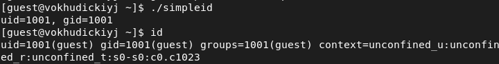
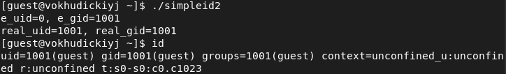
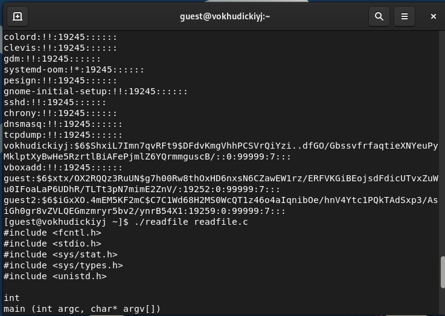
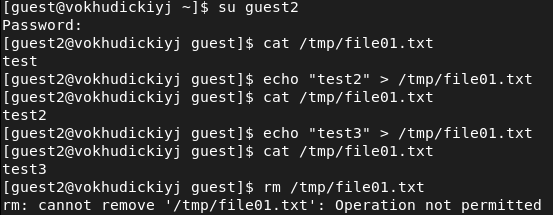
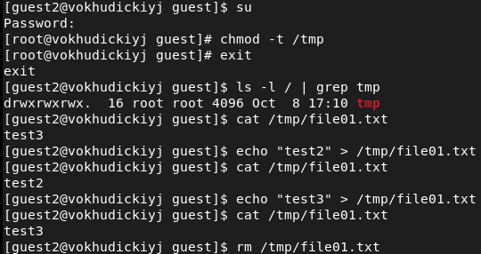
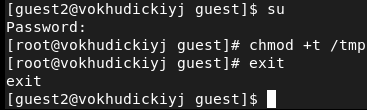

<style>
section::after {
  content: attr(data-marpit-pagination) ' / ' attr(data-marpit-pagination-total);
}
img[alt="center"] {
     display: block;
     margin: 0 auto;
}
h1 {
    font-size: 60px;
    text-align: center;
}
h2 {
    font-size: 30px;
    text-align: left;
    position: relative;
    left: -2em;
    line-height: 0px;
    top: 8em;
}
h3 {
    font-size: 40px;
    text-align: left;
    position: relative;
    left: -0.5em;
    bottom: 0.2em;
}
h4 {
    font-size: 25px;
    text-align: center;
    position: relative;
    left: -0.5em;
    bottom: 0.2em;
}
</style>

# Лабораторная работа №5
## Василий О. Худицкий 
## РУДН, 1 октября 2022, Москва, Россия

---

# Цель лабораторной работы

- Изучение механизмов изменения идентификаторов, применения SetUID- и Sticky-битов. Получение практических навыков работы в консоли с дополнительными атрибутами. Рассмотрение работы механизма смены идентификатора процессов пользователей, а также влияние бита Sticky на запись и удаление файлов.

---

# Задание лабораторной работы

- Выполнить задания лабораторной работы.

- Проанализировать полученные результаты.


---

# Выполнение лабораторной работы

---

# simpleid

```c
#include <sys/types.h>
#include <unistd.h>
#include <stdio.h>
int 
main ()
{
	uid_t uid = geteuid ();
	gid_t gid = getegid ();

	printf ("uid=%d, gid=%d\n", uid, gid);
	return 0;
}
```
---
#### 
##### Рис.1 Выполнение simpleid.c и id

---

# simpleid2

```c
#include <sys/types.h>
#include <unistd.h>
#include <stdio.h>

int
main ()
{
	uid_t real_uid = getuid ();
	uid_t e_uid = geteuid ();
    
	gid_t real_gid = getgid ();
	gid_t e_gid = getegid () ;
    
	printf ("e_uid=%d, e_gid=%d\n", e_uid, e_gid);
	printf ("real_uid=%d, real_gid=%d\n", real_uid,real_gid);
	return 0;
}
```

---

#### 
##### Рис.2 Выполнение simpleid2 и id

---

# readfile

```c
#include <fcntl.h>
#include <stdio.h>
#include <sys/stat.h>
#include <sys/types.h>
#include <unistd.h>

int
main (int argc, char* argv[])
{
	unsigned char buffer[16];
	size_t bytes_read;
	int i;
    
	int fd = open (argv[1], O_RDONLY);
	do
	{
		bytes_read = read (fd, buffer, sizeof (buffer));
		for (i =0; i < bytes_read; ++i) printf("%c", buffer[i]);
	}
    
	while (bytes_read == sizeof (buffer));
	close (fd);
	return 0;
}
```
---

#### 
##### Рис.3 Чтение файлов /etc/shadow и readfile.c

---

# Работа со Sticky-битом

#### 
##### Рис.4 Действия с файлом с атрибутом t от имени guest2

---

#  Работа после снятия Sticky-бита


#### 
##### Рис.5 Действия с файлом без атрибута t от имени guest2

---

# Возвращение атрибута t директории /tmp

#### 
##### Рис.6 Возвращение атрибута t

---

# Выводы
В результате выполнения лабораторных работ я 
- изучил механизмы изменения идентификаторов, применения SetUID- и Sticky-битов;
- рассмотрел работу механизма смены идентификатора процессов пользователей, а также влияние бита Sticky на запись и удаление файлов.