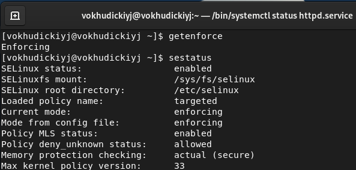
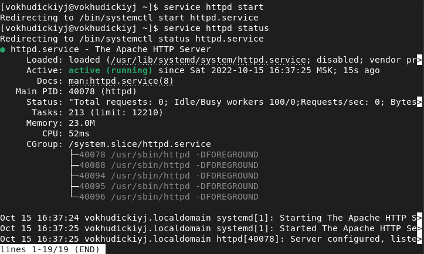
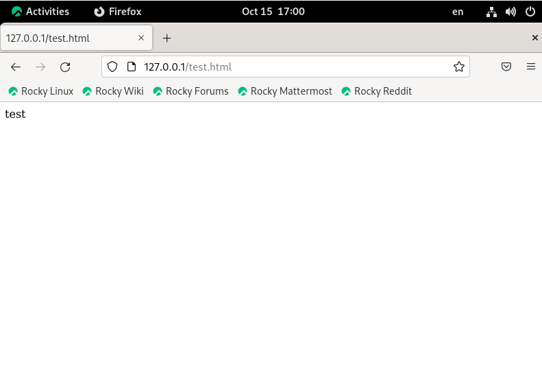
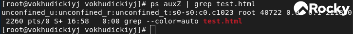
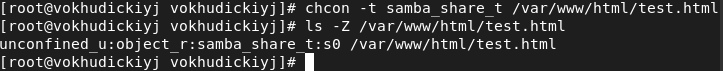
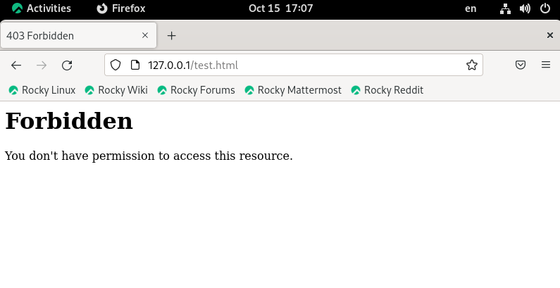
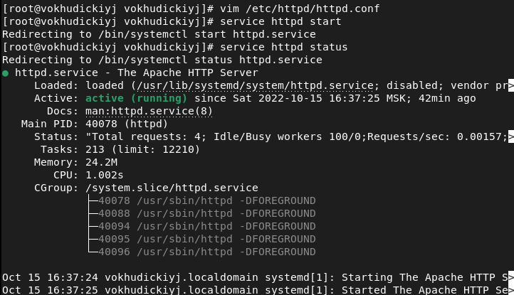

<style>
section::after {
  content: attr(data-marpit-pagination) ' / ' attr(data-marpit-pagination-total);
}
img[alt="center"] {
     display: block;
     margin: 0 auto;
}
h1 {
    font-size: 60px;
    text-align: center;
}
h2 {
    font-size: 30px;
    text-align: left;
    position: relative;
    left: -2em;
    line-height: 0px;
    top: 8em;
}
h3 {
    font-size: 40px;
    text-align: left;
    position: relative;
    left: -0.5em;
    bottom: 0.2em;
}
h4 {
    font-size: 25px;
    text-align: center;
    position: relative;
    left: -0.5em;
    bottom: 0.2em;
}
</style>

# Лабораторная работа №6
## Василий О. Худицкий 
## РУДН, 15 октября 2022, Москва, Россия

---

# Цель лабораторной работы

- Развить навыки администрирования ОС Linux. 
- Получить первое практическое знакомство с технологией SELinux.
- Проверить работу SELinx на практике совместно с веб-сервером Apache.

---

# Выполнение лабораторной работы

---

# Проверка режима и политики SELinux


#### 
##### Рис.1 Режим и политика SELinux

---

# Запуск веб-сервера


#### 
##### Рис.2 Запуск веб-сервера

---

# test.html

```html
<html>
<body>test</body>
</html>
```
---

#### 
##### Рис.4 Файл test.html в браузере
---
#### 
##### Рис.5 Контекст файла test.html

---

# Изменения контекста файла test.html

#### 
##### Рис.6 Изменения контекста файла test.html

---

#### 
##### Рис.7 Сообщение об ошибке


---

# Запуск веб-сервера на порту 81

#### 
##### Рис.8 Запуск на порту 81

---

# Выводы
В ходе выполнения лабораторных работ я 
- развил навыки администрирования ОС Linux;
- получил первое практическое знакомство с технологией SELinux;
- проверил работу SELinx на практике совместно с веб-сервером Apache.