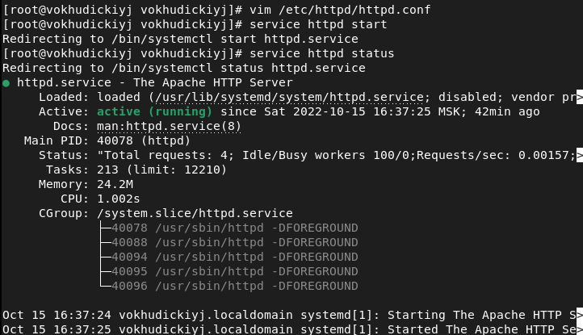
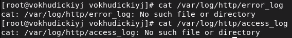
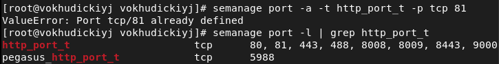
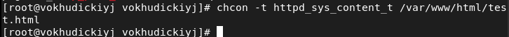
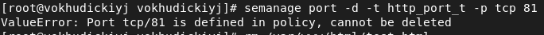
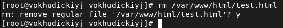

---
# Front matter
lang: ru-RU
title: "Лабораторная работа №6"
subtitle: "Информационная безопасность"
author: "Худицкий Василий Олегович"

# Formatting
toc-title: "Содержание"
toc: true # Table of contents
toc_depth: 2
lof: true # List of figures
fontsize: 12pt
linestretch: 1.5
papersize: a4paper
documentclass: scrreprt
polyglossia-lang: russian
polyglossia-otherlangs: english
mainfont: PT Serif
romanfont: PT Serif
sansfont: PT Sans
monofont: PT Mono
mainfontoptions: Ligatures=TeX
romanfontoptions: Ligatures=TeX
sansfontoptions: Ligatures=TeX,Scale=MatchLowercase
monofontoptions: Scale=MatchLowercase
indent: true
pdf-engine: xelatex
header-includes:
  - \linepenalty=10 # the penalty added to the badness of each line within a paragraph (no associated penalty node) Increasing the value makes tex try to have fewer lines in the paragraph.
  - \interlinepenalty=0 # value of the penalty (node) added after each line of a paragraph.
  - \hyphenpenalty=50 # the penalty for line breaking at an automatically inserted hyphen
  - \exhyphenpenalty=50 # the penalty for line breaking at an explicit hyphen
  - \binoppenalty=700 # the penalty for breaking a line at a binary operator
  - \relpenalty=500 # the penalty for breaking a line at a relation
  - \clubpenalty=150 # extra penalty for breaking after first line of a paragraph
  - \widowpenalty=150 # extra penalty for breaking before last line of a paragraph
  - \displaywidowpenalty=50 # extra penalty for breaking before last line before a display math
  - \brokenpenalty=100 # extra penalty for page breaking after a hyphenated line
  - \predisplaypenalty=10000 # penalty for breaking before a display
  - \postdisplaypenalty=0 # penalty for breaking after a display
  - \floatingpenalty = 20000 # penalty for splitting an insertion (can only be split footnote in standard LaTeX)
  - \raggedbottom # or \flushbottom
  - \usepackage{float} # keep figures where there are in the text
  - \floatplacement{figure}{H} # keep figures where there are in the text
---

# Цель работы

Развить навыки администрирования ОС Linux. Получить первое практическое знакомство с технологией SELinux. Проверить работу SELinx на практике совместно с веб-сервером Apache.

# Задание

Выполнить задания лабораторной работы и проанализировать полученные результаты.

# Теоретическое введение

Мандатное управление доступом (англ. Mandatory access control, MAC) — разграничение доступа субъектов к объектам, основанное на назначении метки конфиденциальности для информации, содержащейся в объектах, и выдаче официальных разрешений (допуска) субъектам на обращение к информации такого уровня конфиденциальности. Также иногда переводится как Принудительный контроль доступа. Это способ, сочетающий защиту и ограничение прав, применяемый по отношению к компьютерным процессам, данным и системным устройствам и предназначенный для предотвращения их нежелательного использования.

Мандатная модель управления доступом, помимо дискреционной и ролевой, является основой реализации разграничительной политики доступа к ресурсам при защите информации ограниченного доступа. При этом данная модель доступа практически не используется «в чистом виде», обычно на практике она дополняется элементами других моделей доступа. Для файловых систем оно может расширять или заменять дискреционный контроль доступа и концепцию пользователей и групп. Самое важное достоинство заключается в том, что пользователь не может полностью управлять доступом к ресурсам, которые он создаёт.

Политика безопасности системы, установленная администратором, полностью определяет доступ, и обычно пользователю не разрешается устанавливать более свободный доступ к своим ресурсам, чем тот, который установлен администратором пользователю. Системы с дискреционным контролем доступа разрешают пользователям полностью определять доступность своих ресурсов, что означает, что они могут случайно или преднамеренно передать доступ неавторизованным пользователям. Такая система запрещает пользователю или процессу, обладающему определённым уровнем доверия, получать доступ к информации, процессам или устройствам более защищённого уровня. Тем самым обеспечивается изоляция пользователей и процессов, как известных, так и не известных системе (неизвестная программа должна быть максимально лишена доверия, и её доступ к устройствам и файлам должен ограничиваться сильнее).


# Выполнение лабораторной работы

Вошёл в систему с полученными учётными данными и убедился, что SELinux работает в режиме enforcing политики targeted с помощью команд *getenforce* и *sestatus*:

{#fig:001}

Обратился с помощью браузера к веб-серверу, запущенному на компьютере, и убедился, что последний работает командой *service httpd status*. Он не работал, поэтому пришлось запустить его так же, но с параметром командой *service httpd start*:

{#fig:002}

Нашёл веб-сервер Apache в списке процессов и определил его контекст безопасности,  используя команду *ps auxZ | grep httpd*:

{#fig:003}

Посмотрел текущее состояние переключателей SELinux для Apache с помощью команды *sestatus -b | grep httpd*:

{#fig:004}

Посмотрел статистику по политике с помощью команды seinfo:

{#fig:005}

Определил тип файлов и поддиректорий, находящихся в директории /var/www, с помощью команды *ls -lZ /var/www*.

Определил тип файлов, находящихся в директории /var/www/html с помощью команды *ls -lZ /var/www/html*.

Определил круг пользователей, которым разрешено создание файлов в директории /var/www/html. Разрешено только владельцу.

{#fig:006}

Создал от имени суперпользователя (так как в дистрибутиве после установки только ему разрешена запись в директорию) html-файл
/var/www/html/test.html следующего содержания:

```html
<html>
<body>test</body>
</html>
```

{#fig:007}

Проверил контекст созданного мной файла:

{#fig:008}

Обратился к файлу через веб-сервер, введя в браузере адрес http://127.0.0.1/test.html. Убедился, что файл был успешно отображён:

{#fig:009}

Изучил справку man httpd_selinux и выяснил, какие контексты файлов определены для httpd. Сопоставил их с типом файла test.html. Проверил контекст файла командой *ls -Z /var/www/html/test.html*:

{#fig:010}

Изменил контекст файла /var/www/html/test.html с httpd_sys_content_t на samba_share_t командами *chcon -t samba_share_t /var/www/html/test.html* и *ls -Z /var/www/html/test.html*. После этого проверил, что контекст поменялся:

{#fig:011}

Попробовал ещё раз получить доступ к файлу через веб-сервер, введя в браузере адрес http://127.0.0.1/test.html. Получил сообщение об ошибке:
{#fig:012}

Проверил, действительно ли права доступа позволяют читать этот файл любому пользователю, с помощью команды *ls -l /var/www/html/test.html*. Просмотрел системный лог-файл командой *tail /var/log/messages*:

 {#fig:013}

Увидел ошибки, аналогичные указанным выше, в файле /var/log/audit/audit.log:

{#fig:014}

Попробовал запустить веб-сервер Apache на прослушивание ТСР-порта 81 (а не 80, как рекомендует IANA и прописано в /etc/services). Для этого в файле /etc/httpd/httpd.conf нашёл строчку Listen 80 и заменил её на Listen 81. Выполнил перезапуск веб-сервера Apache. Сбоя не произошло. 

{#fig:015}

Проанализировал лог-файлы /var/log/http/error_log, /var/log/http/access_log и /var/log/audit/audit.log. Так как сбоя не было, ни в каких файлах не появились записи:

{#fig:016}

Выполнил команду *semanage port -a -t http_port_t -р tcp 81*. Порт 81 уже был определён. После этого проверил список портов командой *semanage port -l | grep http_port_t*. Убедился, что порт 81 в списке:

{#fig:017}

Вернул контекст httpd_sys_cоntent__t к файлу /var/www/html/ test.html командой *chcon -t httpd_sys_content_t /var/www/html/test.html*.
После этого попробовал получить доступ к файлу через веб-сервер, введя в браузере адрес http://127.0.0.1:81/test.html. Я увидел содержимое файла — слово «test».

{#fig:018}

Исправил обратно конфигурационный файл apache, вернув Listen 80. Попытался удалить привязку http_port_t к 81 порту командой *semanage port -d -t http_port_t -p tcp 81*. Совершить удаление не удалось:

{#fig:019}

Удалил файл /var/www/html/test.html командой *rm /var/www/html/test.html*:

{#fig:020}


# Выводы

В ходе выполнения работы я развил навыки администрирования ОС Linux, получил первое практическое знакомство с технологией SELinux, проверил работу SELinx на практике совместно с веб-сервером Apache.

# Список литературы

- <code>[Кулябов Д. С., Королькова А. В., Геворкян М. Н Лабораторная работа №6. Мандатное разграничение прав в Linux](https://esystem.rudn.ru/pluginfile.php/1651755/mod_resource/content/2/006-lab_selinux.pdf)</code>