---
# Front matter
lang: ru-RU
title: "Лабораторная работа №5"
subtitle: "Информационная безопасность"
author: "Худицкий Василий Олегович"

# Formatting
toc-title: "Содержание"
toc: true # Table of contents
toc_depth: 2
lof: true # List of figures
fontsize: 12pt
linestretch: 1.5
papersize: a4paper
documentclass: scrreprt
polyglossia-lang: russian
polyglossia-otherlangs: english
mainfont: PT Serif
romanfont: PT Serif
sansfont: PT Sans
monofont: PT Mono
mainfontoptions: Ligatures=TeX
romanfontoptions: Ligatures=TeX
sansfontoptions: Ligatures=TeX,Scale=MatchLowercase
monofontoptions: Scale=MatchLowercase
indent: true
pdf-engine: lualatex
header-includes:
  - \linepenalty=10 # the penalty added to the badness of each line within a paragraph (no associated penalty node) Increasing the value makes tex try to have fewer lines in the paragraph.
  - \interlinepenalty=0 # value of the penalty (node) added after each line of a paragraph.
  - \hyphenpenalty=50 # the penalty for line breaking at an automatically inserted hyphen
  - \exhyphenpenalty=50 # the penalty for line breaking at an explicit hyphen
  - \binoppenalty=700 # the penalty for breaking a line at a binary operator
  - \relpenalty=500 # the penalty for breaking a line at a relation
  - \clubpenalty=150 # extra penalty for breaking after first line of a paragraph
  - \widowpenalty=150 # extra penalty for breaking before last line of a paragraph
  - \displaywidowpenalty=50 # extra penalty for breaking before last line before a display math
  - \brokenpenalty=100 # extra penalty for page breaking after a hyphenated line
  - \predisplaypenalty=10000 # penalty for breaking before a display
  - \postdisplaypenalty=0 # penalty for breaking after a display
  - \floatingpenalty = 20000 # penalty for splitting an insertion (can only be split footnote in standard LaTeX)
  - \raggedbottom # or \flushbottom
  - \usepackage{float} # keep figures where there are in the text
  - \floatplacement{figure}{H} # keep figures where there are in the text
---

# Цель работы

Изучение механизмов изменения идентификаторов, применения SetUID- и Sticky-битов. Получение практических навыков работы в консоли с дополнительными атрибутами. Рассмотрение работы механизма смены идентификатора процессов пользователей, а также влияние бита Sticky на запись и удаление файлов.

# Задание

Выполнить задания лабораторной работы и проанализировать полученные результаты.

# Теоретическое введение

Дискреционное управление доступом (англ. discretionary access control, DAC) — управление доступом субъектов к объектам на основе списков управления доступом или матрицы доступа. Также используются названия избирательное управление доступом, контролируемое управление доступом и разграничительное управление доступом.

Для каждой пары (субъект — объект) должно быть задано явное и недвусмысленное перечисление допустимых типов доступа, то есть тех типов доступа, которые являются санкционированными для данного субъекта (индивида или группы индивидов) к данному ресурсу (объекту).

Возможны несколько подходов к построению дискреционного управления доступом:

* Каждый объект системы имеет привязанного к нему субъекта, называемого владельцем. Именно владелец устанавливает права доступа к объекту.
* Система имеет одного выделенного субъекта — суперпользователя, который имеет право устанавливать права владения для всех остальных субъектов системы.
* Субъект с определённым правом доступа может передать это право любому другому субъекту.

Возможны и смешанные варианты построения, когда одновременно в системе присутствуют как владельцы, устанавливающие права доступа к своим объектам, так и суперпользователь, имеющий возможность изменения прав для любого объекта и/или изменения его владельца. Именно такой смешанный вариант реализован в большинстве операционных систем, например Unix.

Избирательное управление доступом является основной реализацией разграничительной политики доступа к ресурсам при обработке конфиденциальных сведений, согласно требованиям к системе защиты информации.


# Выполнение лабораторной работы

Проверил, установлен ли у меня компилятор gcc и проследил, чтобы система защиты SELinux не мешала выполнению заданий работы.

Вошел в систему от имени пользователя guest и создал программу simpleid.c:

```c
#include <sys/types.h>
#include <unistd.h>
#include <stdio.h>

int
main ()
{
	uid_t uid = geteuid ();
	gid_t gid = getegid ();
	printf ("uid=%d, gid=%d\n", uid, gid);
	return 0;
}
```

Скомпилировал программу:

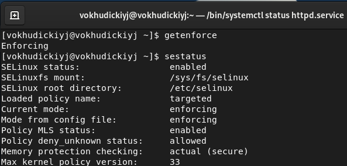{#fig:001}

Выполнил программу simpleid и системную программу id. Результаты совпали :

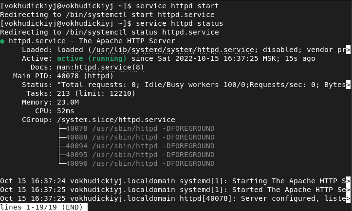{#fig:002}

Усложнил программу, добавив вывод действительных идентификаторов:

```c
#include <sys/types.h>
#include <unistd.h>
#include <stdio.h>

int
main ()
{
	uid_t real_uid = getuid ();
	uid_t e_uid = geteuid ();
    
	gid_t real_gid = getgid ();
	gid_t e_gid = getegid () ;
    
	printf ("e_uid=%d, e_gid=%d\n", e_uid, e_gid);
	printf ("real_uid=%d, real_gid=%d\n", real_uid,real_gid);
	return 0;
}
```

Получившуюся программу назвал simpleid2.c. Скомпилировал и запустил получившуюся программу:

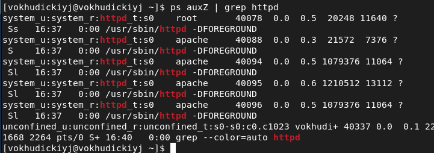{#fig:003}

От имени суперпользователя выполнил команды *chown root:guest /home/guest/simpleid2* и *chmod u+s /home/guest/simpleid2*:

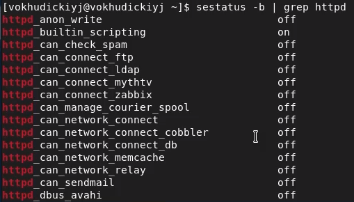{#fig:004}

Команда *chown root:guest /home/guest/simpleid2* меняет владельца файла. Команда *chmod* *u+s /home/guest/simpleid2* меняет права доступа к файлу.

Запустил simpleid2 и id:

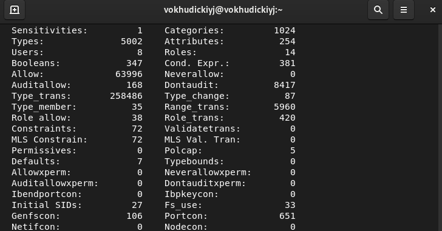{#fig:005}

Команда *id* показывает действительные uid и gid.

Создал программу readfile.c:

```c
#include <fcntl.h>
#include <stdio.h>
#include <sys/stat.h>
#include <sys/types.h>
#include <unistd.h>

int
main (int argc, char* argv[])
{
	unsigned char buffer[16];
	size_t bytes_read;
	int i;
    
	int fd = open (argv[1], O_RDONLY);
	do
	{
		bytes_read = read (fd, buffer, sizeof (buffer));
		for (i =0; i < bytes_read; ++i) printf("%c", buffer[i]);
	}
    
	while (bytes_read == sizeof (buffer));
	close (fd);
	return 0;
}
```

Откомпилировал её командой *gcc readfile.c -o readfile*:

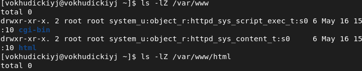{#fig:006}

Сменил владельца у файла readfile.c и изменил права так, чтобы только суперпользователь мог прочитать его.

Проверил, что пользователь guest не может прочитать файл readfile.c:

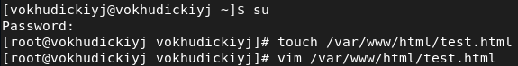{#fig:007}

Сменил у программы readfile владельца и установил SetUID-бит:

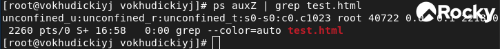{#fig:008}

Проверил, может ли программа readfile прочитать файлы /etc/shadow и readfile.c:

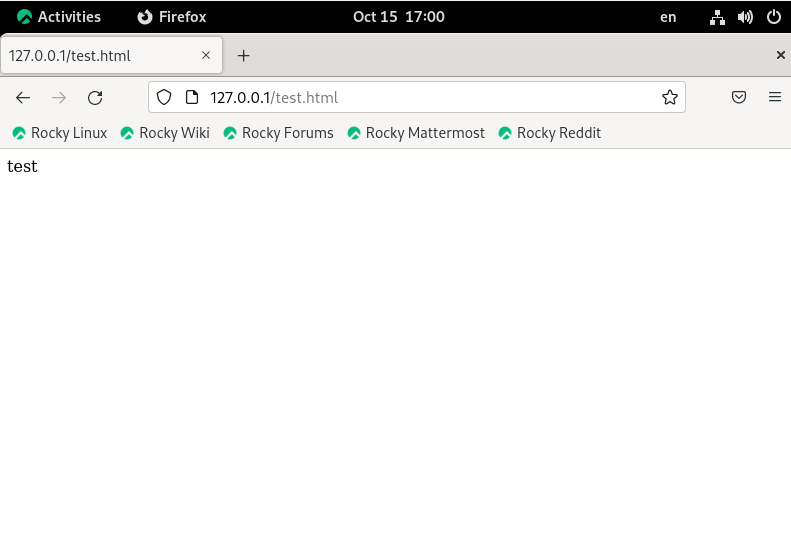{#fig:09}

Так как у программы установлен SetUID-бит, то при её выполнении предоставляются права владельца файла (в данном случае root). Поэтому программа может прочитать файл с правами доступа только для root.

С помощью команды  *ls -l / | grep tmp* выяснил, установлен ли атрибут Sticky на директории /tmp:

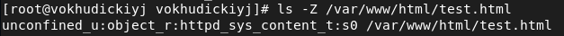{#fig:010}

От имени пользователя guest создал файл file01.txt в директории /tmp со словом test командой *echo "test" > /tmp/file01.txt*.

Просмотрел атрибуты у только что созданного файла и командой *chmod o+rw /tmp/file01.txt* разрешил чтение и запись для категории пользователей «все остальные».

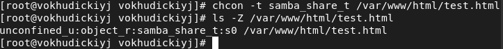{#fig:011}

От пользователя guest2 (не являющегося владельцем) попробовал прочитать файл /tmp/file01.txt: *cat /*tmp/*file01.txt*.

От пользователя guest2 попробовал дозаписать в файл /tmp/file01.txt слово test2 командой *echo "test2" >> /tmp/file01.txt*. Мне удалось выполнить операцию.

Проверил содержимое файла командой *cat /tmp/file01.txt*

От пользователя guest2 попробовал записать в файл /tmp/file01.txt слово test3, стерев при этом всю имеющуюся в файле информацию командой echo *"test3" > /tmp/file01.txt*. Мне удалось выполнить операцию.

 Проверил содержимое файла командой *cat /tmp/file01.txt*.

От пользователя guest2 попробовал удалить файл /tmp/file01.txt командой *rm /tmp/file01.txt*. Мне не удалось удалить файл:

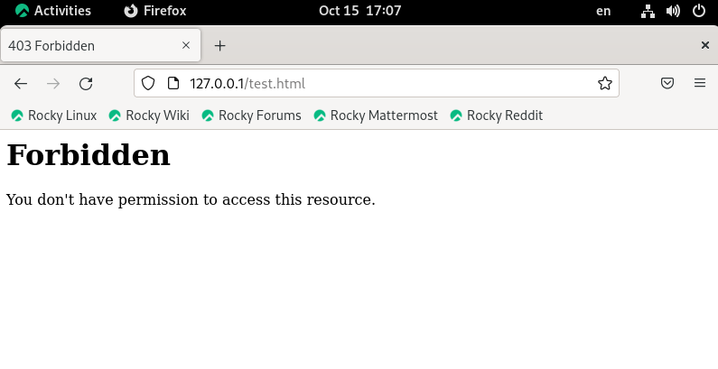{#fig:012}

Повысил свои права до суперпользователя командой *su* и выполнил после этого команду *chmod -t /tmp*, снимающую атрибут t (Sticky-бит) с директории /tmp.

Повторил предыдущие шаги:

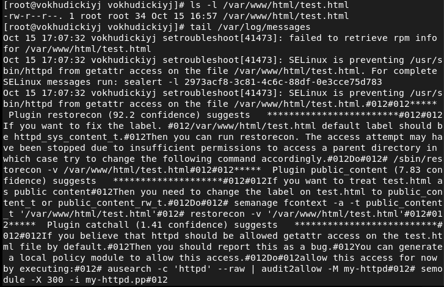{#fig:013}

Мне удалось удалить файл от имени пользователя, не являющегося его владельцем, так как Sticky-bit позволяет защищать файлы от случайного удаления, когда несколько пользователей имеют права на запись в один и тот же каталог. Если у файла атрибут t стоит, значит пользователь может удалить файл, только если он является пользователем-владельцем файла или каталога, в котором содержится файл. Если же этот атрибут не установлен, то удалить файл могут все пользователи, которым позволено удалять файлы из каталога.

Повысил свои права до суперпользователя и вернул атрибут t на директорию /tmp с помощью команды *chmod +t /tmp*:

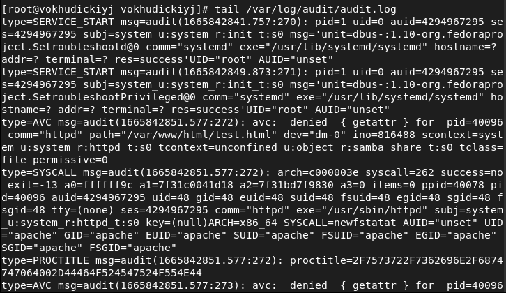{#fig:014}


# Выводы

В результате выполнения работы я изучил механизмы изменения идентификаторов, применения SetUID- и Sticky-битов. Рассмотрел работу механизма смены идентификатора процессов пользователей, а также влияние бита Sticky на запись и удаление файлов.

# Список литературы

- <code>[Кулябов Д. С., Королькова А. В., Геворкян М. Н Лабораторная работа №5. Дискреционное разграничение прав в Linux. Исследование влияния дополнительных атрибутов](https://esystem.rudn.ru/pluginfile.php/1651753/mod_resource/content/2/005-lab_discret_sticky.pdf)</code>