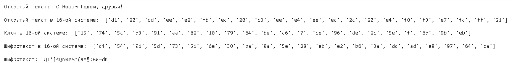
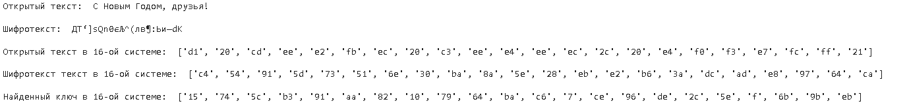
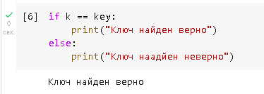

<style>
section::after {
  content: attr(data-marpit-pagination) ' / ' attr(data-marpit-pagination-total);
}
img[alt="center"] {
     display: block;
     margin: 0 auto;
}
h1 {
    font-size: 60px;
    text-align: center;
}
h2 {
    font-size: 30px;
    text-align: left;
    position: relative;
    left: -2em;
    line-height: 0px;
    top: 8em;
}
h3 {
    font-size: 40px;
    text-align: left;
    position: relative;
    left: -0.5em;
    bottom: 0.2em;
}
h4 {
    font-size: 25px;
    text-align: center;
    position: relative;
    left: -0.5em;
    bottom: 0.2em;
}
</style>

# Лабораторная работа №7
## Василий О. Худицкий 
## РУДН, 22 октября 2022, Москва, Россия

---

# Цель лабораторной работы

- Освоить на практике применение режима однократного гаммирования.

---

# Задание

Нужно подобрать ключ, чтобы получить сообщение «С Новым Годом, друзья!». Требуется разработать приложение, позволяющее шифровать и дешифровать данные в режиме однократного гаммирования. Приложение должно: 

1. Определить вид шифротекста при известном ключе и известном открытом тексте. 
2. Определить ключ, с помощью которого шифротекст может быть преобразован в некоторый фрагмент текста, представляющий собой один из возможных вариантов прочтения открытого текста.

---
# Выполнение лабораторной работы

---

### Определение вида шифротекста при известном ключе и известном открытом тексте


```python
def encrypt(text):
    print("Открытый текст: ", text)

    new_text = []
    for i in text:
        new_text.append(i.encode("cp1251").hex())
    print("\nОткрытый текст в 16-ой системе: ", new_text)

    r = np.random.randint(0, 255, len(text))
    key = [hex(i)[2:] for i in r]
    print("\nКлюч в 16-ой системе: ", key)

    xor_text = []
    for i in range(len(new_text)):
        xor_text.append("{:02x}".format(int(key[i], 16) ^ int(new_text[i], 16)))
    print("\nШифротекст в 16-ой системе: ", xor_text)

    en_text = bytearray.fromhex("".join(xor_text)).decode("cp1251")
    print("\nШифротекст: ", en_text)
    
    return key, en_text
```

---
# Результат вызова первой функции

#### 
##### Рис.1  Определение вида шифротекста при известном ключе и известном открытом тексте

---

# Определение вида ключа при известном тексте и шифротексте

```python
def find_key(text, en_text):
    print("Открытый текст: ", text)
    print("\nШифротекст: ", en_text)
    
    new_text = []
    for i in text:
        new_text.append(i.encode("cp1251").hex())
    print("\nОткрытый текст в 16-ой системе: ", new_text)
    
    tmp_text = []
    for i in en_text:
        tmp_text.append(i.encode("cp1251").hex())
    print("\nШифротекст текст в 16-ой системе: ", tmp_text)
    
    key = [hex(int(k,16)^int(t,16))[2:] for (k,t) in zip(new_text, tmp_text)]
    print("\nНайденный ключ в 16-ой системе: ", key)
    return key
```

---

# Результат вызова второй функции

#### 
##### Рис.2 Определение вида ключа

---

# Проверка правильности нахождения ключа

#### 
##### Рис.3 Проверка правильности нахождения ключа
---

# Выводы
В ходе выполнения данной лабораторной работы я освоил на практике применение режима однократного гаммирования.