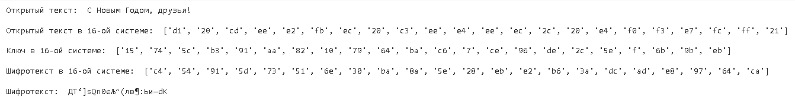
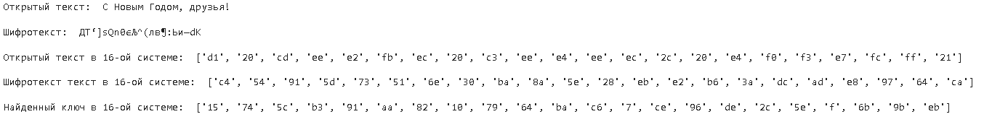
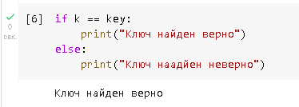

---
# Front matter
lang: ru-RU
title: "Лабораторная работа №7"
subtitle: "Информационная безопасность"
author: "Худицкий Василий Олегович"

# Formatting
toc-title: "Содержание"
toc: true # Table of contents
toc_depth: 2
lof: true # List of figures
fontsize: 12pt
linestretch: 1.5
papersize: a4paper
documentclass: scrreprt
polyglossia-lang: russian
polyglossia-otherlangs: english
mainfont: PT Serif
romanfont: PT Serif
sansfont: PT Sans
monofont: PT Mono
mainfontoptions: Ligatures=TeX
romanfontoptions: Ligatures=TeX
sansfontoptions: Ligatures=TeX,Scale=MatchLowercase
monofontoptions: Scale=MatchLowercase
indent: true
pdf-engine: xelatex
header-includes:
  - \linepenalty=10 # the penalty added to the badness of each line within a paragraph (no associated penalty node) Increasing the value makes tex try to have fewer lines in the paragraph.
  - \interlinepenalty=0 # value of the penalty (node) added after each line of a paragraph.
  - \hyphenpenalty=50 # the penalty for line breaking at an automatically inserted hyphen
  - \exhyphenpenalty=50 # the penalty for line breaking at an explicit hyphen
  - \binoppenalty=700 # the penalty for breaking a line at a binary operator
  - \relpenalty=500 # the penalty for breaking a line at a relation
  - \clubpenalty=150 # extra penalty for breaking after first line of a paragraph
  - \widowpenalty=150 # extra penalty for breaking before last line of a paragraph
  - \displaywidowpenalty=50 # extra penalty for breaking before last line before a display math
  - \brokenpenalty=100 # extra penalty for page breaking after a hyphenated line
  - \predisplaypenalty=10000 # penalty for breaking before a display
  - \postdisplaypenalty=0 # penalty for breaking after a display
  - \floatingpenalty = 20000 # penalty for splitting an insertion (can only be split footnote in standard LaTeX)
  - \raggedbottom # or \flushbottom
  - \usepackage{float} # keep figures where there are in the text
  - \floatplacement{figure}{H} # keep figures where there are in the text
---

# Цель работы

Освоить на практике применение режима однократного гаммирования.

# Задание

Нужно подобрать ключ, чтобы получить сообщение «С Новым Годом, друзья!». Требуется разработать приложение, позволяющее шифровать и дешифровать данные в режиме однократного гаммирования. Приложение должно: 

1. Определить вид шифротекста при известном ключе и известном открытом тексте. 
2. Определить ключ, с помощью которого шифротекст может быть преобразован в некоторый фрагмент текста, представляющий собой один из возможных вариантов прочтения открытого текста.

# Теоретическое введение

Предложенная Г. С. Вернамом так называемая «схема однократного использования (гаммирования)» является простой, но надёжной схемой шифрования данных.
Гаммирование представляет собой наложение (снятие) на открытые (зашифрованные) данные последовательности элементов других данных, полученной с помощью некоторого криптографического алгоритма, для получения зашифрованных (открытых) данных. Иными словами, наложение гаммы — это сложение её элементов с элементами открытого (закрытого) текста по некоторому фиксированному модулю, значение которого представляет собой известную часть алгоритма шифрования.
В соответствии с теорией криптоанализа, если в методе шифрования используется однократная вероятностная гамма (однократное гаммирование)
той же длины, что и подлежащий сокрытию текст, то текст нельзя раскрыть.
Даже при раскрытии части последовательности гаммы нельзя получить информацию о всём скрываемом тексте. Наложение гаммы по сути представляет собой выполнение операции сложения по модулю 2 (XOR) (обозначаемая знаком ⊕) между элементами гаммы и элементами подлежащего сокрытию текста. Напомним, как работает операция XOR над битами: 0 ⊕ 0 = 0, 0 ⊕ 1 = 1, 1 ⊕ 0 = 1, 1 ⊕ 1 = 0.
Такой метод шифрования является симметричным, так как двойное прибавление одной и той же величины по модулю 2 восстанавливает исходное значение, а шифрование и расшифрование выполняется одной и той же программой.
Если известны ключ и открытый текст, то задача нахождения шифротекста заключается в применении к каждому символу открытого текста следующего правила:
$$C_i = P_i ⊕ K_i$$,
где $C_i$ — i-й символ получившегося зашифрованного послания, $P_i$ — i-й символ открытого текста, $K_i$ — i-й символ ключа, i = 1, m. Размерности
открытого текста и ключа должны совпадать, и полученный шифротекст будет такой же длины. Если известны шифротекст и открытый текст, то обе части равенства необходимо сложить по модулю 2 с $P_i$:
$$C_i ⊕ P_i = P_i ⊕ K_i ⊕ P_i = K_i$$,
$$K_i = C_i ⊕ P_i$$.
Открытый текст имеет символьный вид, а ключ — шестнадцатеричное представление. Ключ также можно представить в символьном виде, воспользовавшись таблицей ASCII-кодов.
К. Шеннон доказал абсолютную стойкость шифра в случае, когда однократно используемый ключ, длиной, равной длине исходного сообщения,
является фрагментом истинно случайной двоичной последовательности с равномерным законом распределения. Криптоалгоритм не даёт никакой информации об открытом тексте: при известном зашифрованном сообщении $C$ все различные ключевые последовательности $K$ возможны и равновероятны, а значит, возможны и любые сообщения $P$.
Необходимые и достаточные условия абсолютной стойкости шифра:

-  полная случайность ключа;
- равенство длин ключа и открытого текста;
- однократное использование ключа.


# Выполнение лабораторной работы

Импортирую библиотеку numpy:

{#fig:001}

1. Определяю вид шифротекста при известном ключе и известном открытом
   тексте.
   Функция получает на вход строку, переводит ее в шестнадцатеричную систему
   счисления. Затем в программе случайно генерируется ключ. При помощи ключа
   получаю зашифрованное сообщение в шестнадцатеричной системе счисления. Затем
   перевожу это сообщение в строковый вид.
   
   ```python
   def encrypt(text):
       print("Открытый текст: ", text)
   
       new_text = []
       for i in text:
           new_text.append(i.encode("cp1251").hex())
       print("\nОткрытый текст в 16-ой системе: ", new_text)
   
       r = np.random.randint(0, 255, len(text))
       key = [hex(i)[2:] for i in r]
       print("\nКлюч в 16-ой системе: ", key)
   
       xor_text = []
       for i in range(len(new_text)):
           xor_text.append("{:02x}".format(int(key[i], 16) ^ int(new_text[i], 16)))
       print("\nШифротекст в 16-ой системе: ", xor_text)
   
       en_text = bytearray.fromhex("".join(xor_text)).decode("cp1251")
       print("\nШифротекст: ", en_text)
       
       return key, en_text
   ```

​	{#fig:002}

​	Результат работы функции:

{#fig:003}

2. Определяю ключ, с помощью которого шифротекст может быть преобразован в некоторый фрагмент текста, представляющий собой один из возможных вариантов прочтения открытого текста. Функция нахождения ключа получает на вход две строки: открытый текст и зашифрованный. Затем она преобразует строки в шестнадцатеричный формат и выполняет операцию XOR для нахождения ключа.
   
   ```python
   def find_key(text, en_text):
       print("Открытый текст: ", text)
       print("\nШифротекст: ", en_text)
       
       new_text = []
       for i in text:
           new_text.append(i.encode("cp1251").hex())
       print("\nОткрытый текст в 16-ой системе: ", new_text)
       
       tmp_text = []
       for i in en_text:
           tmp_text.append(i.encode("cp1251").hex())
       print("\nШифротекст текст в 16-ой системе: ", tmp_text)
       
       key = [hex(int(k,16)^int(t,16))[2:] for (k,t) in zip(new_text, tmp_text)]
       print("\nНайденный ключ в 16-ой системе: ", key)
       return key
   ```
   
   {#fig:004}
   
   Результат работы функции:
   
   {#fig:005}

Проверка правильности нахождения ключа:

{#fig:006}


# Контрольные вопросы

1. Поясните смысл однократного гаммирования.
    Гаммирование – выполнение операции XOR между элементами гаммы и
    элементами подлежащего сокрытию текста. Если в методе шифрования используется
    однократная вероятностная гамма (однократное гаммирование) той же длины, что и
    подлежащий сокрытию текст, то текст нельзя раскрыть. Даже при раскрытии части
    последовательности гаммы нельзя получить информацию о всём скрываемом тексте.

2. Перечислите недостатки однократного гаммирования.
  Абсолютная стойкость шифра доказана только для случая, когда однократно
  используемый ключ, длиной, равной длине исходного сообщения, является
  фрагментом истинно случайной двоичной последовательности с равномерным
  законом распределения.

3. Перечислите преимущества однократного гаммирования.
  Во-первых, такой способ симметричен, т.е. двойное прибавление одной и той
  же величины по модулю 2 восстанавливает исходное значение. Во-вторых,
  шифрование и расшифрование может быть выполнено одной и той же программой.
  Наконец, Криптоалгоритм не даёт никакой информации об открытом тексте: при
  известном зашифрованном сообщении C все различные ключевые
  последовательности K возможны и равновероятны, а значит, возможны и любые
  сообщения P.

4. Почему длина открытого текста должна совпадать с длиной ключа?
  Если ключ короче текста, то операция XOR будет применена не ко всем
  элементам и конец сообщения будет не закодирован. Если ключ будет длиннее, то
  появится неоднозначность декодирования.

5. Какая операция используется в режиме однократного гаммирования, назовите
  её особенности?
  Наложение гаммы по сути представляет собой выполнение побитовой
  операции сложения по модулю 2, т.е. мы должны сложить каждый элемент гаммы с
  соответствующим элементом ключа. Данная операция является симметричной, так
  как прибавление одной и той же величины по модулю 2 восстанавливает исходное
  значение

6. Как по открытому тексту и ключу получить шифротекст?
  В таком случае задача сводится к правилу:
  Ci = Pi ⊕ Ki, т.е. мы поэлементно получаем символы зашифрованного сообщения,
  применяя операцию исключающего или к соответствующим элементам ключа и
  открытого текста.

7. Как по открытому тексту и шифротексту получить ключ?
  Подобная задача решается путем применения операции исключающего или к
  последовательностям символов зашифрованного и открытого сообщений:

  $$K_i = P_i ⊕ C_i.$$

8. В чем заключаются необходимые и достаточные условия абсолютной
  стойкости шифра?
  Необходимые и достаточные условия абсолютной стойкости шифра:

  – полная случайность ключа;
  – равенство длин ключа и открытого текста;
  – однократное использование ключа.

# Выводы

В ходе выполнения данной лабораторной работы я освоил на практике применение режима однократного гаммирования.

# Список литературы

- <code>[Кулябов Д. С., Королькова А. В., Геворкян М. Н Лабораторная работа №7. Элементы криптографии. Однократное гаммирование](https://esystem.rudn.ru/pluginfile.php/1651757/mod_resource/content/2/007-lab_crypto-gamma.pdf)</code>