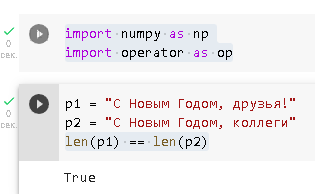
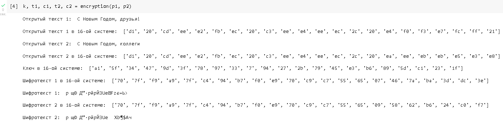
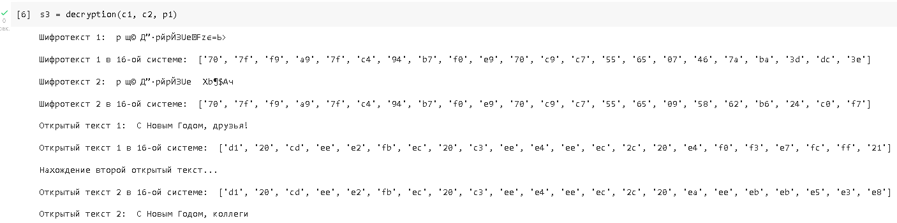

---
# Front matter
lang: ru-RU
title: "Лабораторная работа №8"
subtitle: "Информационная безопасность"
author: "Худицкий Василий Олегович"

# Formatting
toc-title: "Содержание"
toc: true # Table of contents
toc_depth: 2
lof: true # List of figures
fontsize: 12pt
linestretch: 1.5
papersize: a4paper
documentclass: scrreprt
polyglossia-lang: russian
polyglossia-otherlangs: english
mainfont: PT Serif
romanfont: PT Serif
sansfont: PT Sans
monofont: PT Mono
mainfontoptions: Ligatures=TeX
romanfontoptions: Ligatures=TeX
sansfontoptions: Ligatures=TeX,Scale=MatchLowercase
monofontoptions: Scale=MatchLowercase
indent: true
pdf-engine: xelatex
header-includes:
  - \linepenalty=10 # the penalty added to the badness of each line within a paragraph (no associated penalty node) Increasing the value makes tex try to have fewer lines in the paragraph.
  - \interlinepenalty=0 # value of the penalty (node) added after each line of a paragraph.
  - \hyphenpenalty=50 # the penalty for line breaking at an automatically inserted hyphen
  - \exhyphenpenalty=50 # the penalty for line breaking at an explicit hyphen
  - \binoppenalty=700 # the penalty for breaking a line at a binary operator
  - \relpenalty=500 # the penalty for breaking a line at a relation
  - \clubpenalty=150 # extra penalty for breaking after first line of a paragraph
  - \widowpenalty=150 # extra penalty for breaking before last line of a paragraph
  - \displaywidowpenalty=50 # extra penalty for breaking before last line before a display math
  - \brokenpenalty=100 # extra penalty for page breaking after a hyphenated line
  - \predisplaypenalty=10000 # penalty for breaking before a display
  - \postdisplaypenalty=0 # penalty for breaking after a display
  - \floatingpenalty = 20000 # penalty for splitting an insertion (can only be split footnote in standard LaTeX)
  - \raggedbottom # or \flushbottom
  - \usepackage{float} # keep figures where there are in the text
  - \floatplacement{figure}{H} # keep figures where there are in the text
---

# Цель работы

Освоить на практике применение режима однократного гаммирования на примере кодирования различных исходных текстов одним ключом.

# Задание

Два текста кодируются одним ключом (однократное гаммирование). Требуется не зная ключа и не стремясь его определить, прочитать оба текста. Необходимо разработать приложение, позволяющее шифровать и дешифровать тексты $P_1$ и $P_2$ в режиме однократного гаммирования. Приложение должно определить вид шифротекстов $C_1$ и $C_2$ обоих текстов $P_1$ и $P_2$ при известном ключе; Необходимо определить и выразить аналитически способ, при котором злоумышленник может прочитать оба текста, не зная ключа и не стремясь его определить.

# Теоретическое введение

Предложенная Г. С. Вернамом так называемая «схема однократного использования (гаммирования)» является простой, но надёжной схемой шифрования данных.
Гаммирование представляет собой наложение (снятие) на открытые (зашифрованные) данные последовательности элементов других данных, полученной с помощью некоторого криптографического алгоритма, для получения зашифрованных (открытых) данных. Иными словами, наложение гаммы — это сложение её элементов с элементами открытого (закрытого) текста по некоторому фиксированному модулю, значение которого представляет собой известную часть алгоритма шифрования.
В соответствии с теорией криптоанализа, если в методе шифрования используется однократная вероятностная гамма (однократное гаммирование)
той же длины, что и подлежащий сокрытию текст, то текст нельзя раскрыть.
Даже при раскрытии части последовательности гаммы нельзя получить информацию о всём скрываемом тексте. Наложение гаммы по сути представляет собой выполнение операции сложения по модулю 2 (XOR) (обозначаемая знаком ⊕) между элементами гаммы и элементами подлежащего сокрытию текста. Напомним, как работает операция XOR над битами: 0 ⊕ 0 = 0, 0 ⊕ 1 = 1, 1 ⊕ 0 = 1, 1 ⊕ 1 = 0.
Такой метод шифрования является симметричным, так как двойное прибавление одной и той же величины по модулю 2 восстанавливает исходное значение, а шифрование и расшифрование выполняется одной и той же программой.
Если известны ключ и открытый текст, то задача нахождения шифротекста заключается в применении к каждому символу открытого текста следующего правила:
$$C_i = P_i ⊕ K_i$$,
где $C_i$ — i-й символ получившегося зашифрованного послания, $P_i$ — i-й символ открытого текста, $K_i$ — i-й символ ключа, i = 1, m. Размерности
открытого текста и ключа должны совпадать, и полученный шифротекст будет такой же длины. Если известны шифротекст и открытый текст, то обе части равенства необходимо сложить по модулю 2 с $P_i$:
$$C_i ⊕ P_i = P_i ⊕ K_i ⊕ P_i = K_i$$,
$$K_i = C_i ⊕ P_i$$.
Открытый текст имеет символьный вид, а ключ — шестнадцатеричное представление. Ключ также можно представить в символьном виде, воспользовавшись таблицей ASCII-кодов.
К. Шеннон доказал абсолютную стойкость шифра в случае, когда однократно используемый ключ, длиной, равной длине исходного сообщения,
является фрагментом истинно случайной двоичной последовательности с равномерным законом распределения. Криптоалгоритм не даёт никакой информации об открытом тексте: при известном зашифрованном сообщении $C$ все различные ключевые последовательности $K$ возможны и равновероятны, а значит, возможны и любые сообщения $P$.
Необходимые и достаточные условия абсолютной стойкости шифра:

-  полная случайность ключа;
- равенство длин ключа и открытого текста;
- однократное использование ключа.


# Выполнение лабораторной работы

Импортирую библиотеки numpy и operator, задаю открытые тексты $P_1$ и $P_2$ одинаковой длины:

 ```python
 import numpy as np
 import operator as op
 ```

```python
p1 = "С Новым Годом, друзья!"
p2 = "С Новым Годом, коллеги"
len(p1) == len(p2)
```

{#fig:001}

1. Определяю вид шифротекстов $C_1$ и $C_2$ обоих текстов $P_1$ и $P_2$ при известном ключе.
   
   ```python
   def encryption(text1, text2):
       print("Открытый текст 1: ", text1)
       new_text1 = []
       for i in text1:
           new_text1.append(i.encode("cp1251").hex())
       print("\nОткрытый текст 1 в 16-ой системе: ", new_text1)
       
       print("\nОткрытый текст 2: ", text2)
       new_text2 = []
       for i in text2:
           new_text2.append(i.encode("cp1251").hex())
       print("\nОткрытый текст 2 в 16-ой системе: ", new_text2)
       
       r = np.random.randint(0, 255, len(text1))
       key = [hex(i)[2:] for i in r]
       new_key = []
       for i in key:
               new_key.append(i.encode("cp1251").hex().upper())
       print("\nКлюч в 16-ой системе: ", key)
       
       xor_text1 = []
       for i in range(len(new_text1)):
           xor_text1.append("{:02x}".format(int(key[i], 16) ^ int(new_text1[i], 16)))
       print("\nШифротекст 1 в 16-ой системе: ", xor_text1)
       c1 = bytearray.fromhex("".join(xor_text1)).decode("cp1251")
       print("\nШифротекст 1: ", c1)
       
       xor_text2 = []
       for i in range(len(new_text2)):
           xor_text2.append("{:02x}".format(int(key[i], 16) ^ int(new_text2[i], 16)))
       print("\nШифротекст 2 в 16-ой системе: ", xor_text2)
       c2 = bytearray.fromhex("".join(xor_text2)).decode("cp1251")
       print("\nШифротекст 2: ", c2)
       
       return key, xor_text1, c1, xor_text2, c2
   ```

2. Определяю  и выражаю способ, при котором злоумышленник может прочитать оба текста, не зная ключа и не стремясь его определить.
  
   ```python
   def decryption(c1, c2, p1):
       print("Шифротекст 1: ", c1)
       new_c1 = []
       for i in c1:
           new_c1.append(i.encode("cp1251").hex())
       print("\nШифротекст 1 в 16-ой системе: ", new_c1)
       
       print("\nШифротекст 2: ", c2)
       new_c2 = []
       for i in c2:
           new_c2.append(i.encode("cp1251").hex())
       print("\nШифротекст 2 в 16-ой системе: ", new_c2)
       
       print("\nОткрытый текст 1: ", p1)
       new_p1 = []
       for i in p1:
           new_p1.append(i.encode("cp1251").hex())
       print("\nОткрытый текст 1 в 16-ой системе: ", new_p1)
       
       print("\nНахождение второй открытый текст...")
       
       xor_tmp = []
       sp2 = []
       for i in range(len(p1)):
           xor_tmp.append("{:02x}".format(int(new_c1[i], 16) ^ int(new_c2[i], 16)))
           sp2.append("{:02x}".format(int(xor_tmp[i], 16) ^ int(new_p1[i], 16)))
       print("\nОткрытый текст 2 в 16-ой системе: ", sp2)
       
       p2 = bytearray.fromhex("".join(sp2)).decode("cp1251")
       print("\nОткрытый текст 2: ", p2)
       return p2, sp2
   ```
   

Результаты работы программы:

{#fig:002}

{#fig:003}


# Контрольные вопросы

1. Как, зная один из текстов ($P_1$ или $P_2$), определить другой, не зная при этом ключа?
   Для этого надо воспользоваться формулой: 

   $$C_1 ⊕ C_2 ⊕ P_1 = P_1 ⊕ P_2 ⊕ P_1 = P_2$$, 

   где $С_1$ и $С_2$ – шифротексты. Как видно, ключ в данной формуле не используется.

2. Что будет при повторном использовании ключа при шифровании текста?
   В таком случае мы получим исходное сообщение.

3. Как реализуется режим шифрования однократного гаммирования одним ключом двух открытых текстов?Он реализуется по следующей формуле:$C_1 = P_1 ⊕ K$, $C_2 = P_2 ⊕ K$, где $С_1$ и $С_2$ – шифротексты, $K$ - ключ шифрования.

4. Перечислите недостатки шифрования одним ключом двух открытых текстов.

   - Имея на руках одно из сообщений в открытом виде и оба шифротекста, злоумышленник способен расшифровать каждое сообщение, не зная ключа. 

   - Зная шаблон сообщений, злоумышленник получает возможность определить те символы сообщения $P_2$, которые находятся на позициях известного шаблона сообщения $P_1$. В соответствии с логикой сообщения $P_2$, злоумышленник имеет реальный шанс узнать ещё некоторое количество символов сообщения $P_2$. Таким образом, применяя формулу из п. 1, с подстановкой вместо $P_1$ полученных на предыдущем шаге новых символов сообщения $P_2$ злоумышленник если не прочитает оба сообщения, то значительно уменьшит пространство их поиска.

   - Зная ключ, злоумышленник смоет расшифровать все сообщения, которые были закодированы при его помощи.

5. Перечислите преимущества шифрования одним ключом двух открытых текстов.
   Такой подход помогает упростить процесс шифрования и дешифровки. Также, при отправке сообщений между 2-я компьютерами, удобнее пользоваться одним общим ключом для передаваемых данных.

# Выводы

В ходе выполнения данной лабораторной работы я освоил на практике применение режима однократного гаммирования на примере кодирования различных исходных текстов одним ключом.

# Список литературы

- <code>[Кулябов Д. С., Королькова А. В., Геворкян М. Н Лабораторная работа №8. Элементы криптографии. Шифрование (кодирование) различных исходных текстов одним ключом](https://esystem.rudn.ru/pluginfile.php/1651759/mod_resource/content/2/008-lab_crypto-key.pdf)</code>